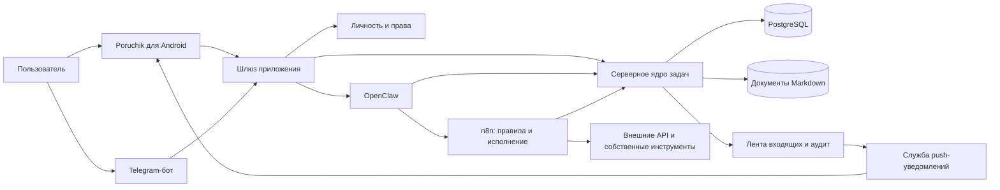
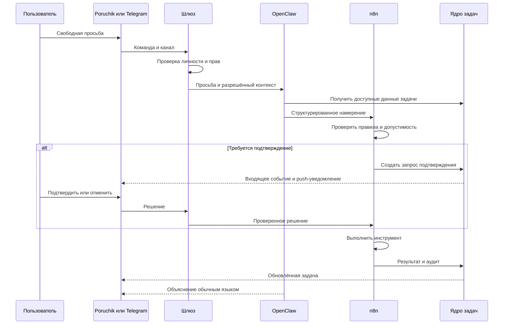
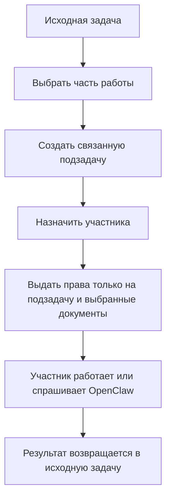
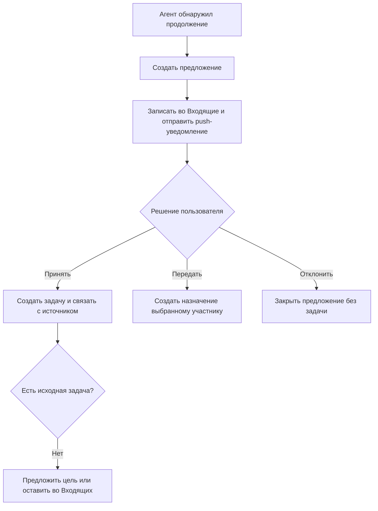
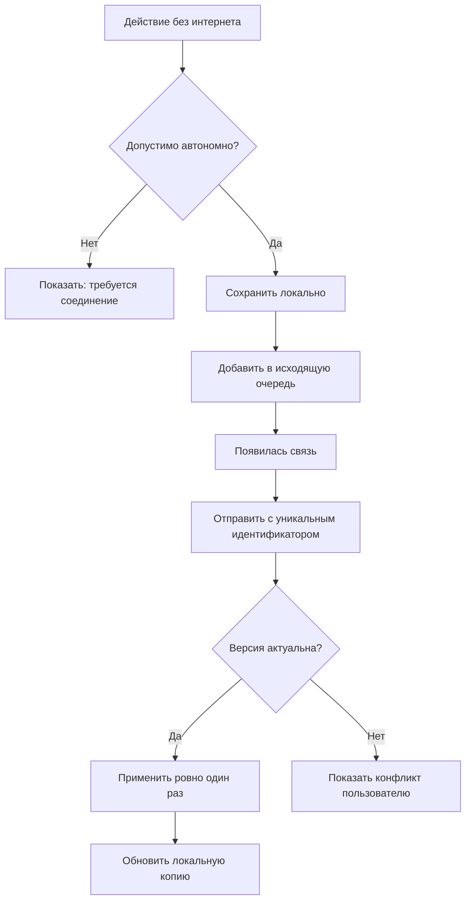
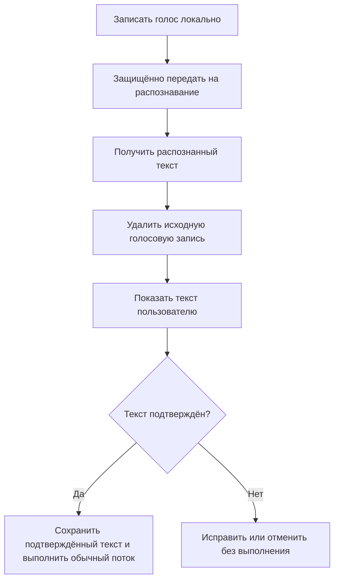

# Poruchik — архитектура и потоки

## Разделение ответственности

- **Каналы Poruchik для Android и Telegram** принимают команды и показывают состояние.
- **Шлюз приложения** проверяет личность, права и допустимость внешнего запроса.
- **OpenClaw** понимает свободную просьбу, собирает разрешённый контекст и выбирает возможность.
- **n8n** применяет обязательные правила, выполняет интеграции и запрашивает подтверждение.
- **Серверное ядро задач** хранит фактическое состояние задач, связей, прав, входящих и запусков.
- **PostgreSQL** хранит структурированные данные.
- **Markdown-хранилище** хранит человекочитаемые документы.

## Компоненты

## Границы доверия

- Мобильному приложению доступен только шлюз.
- OpenClaw, n8n, PostgreSQL и Markdown-хранилище остаются во внутренней сети.
- Приложение не назначает себе роль: сервер определяет её по сессии.
- OpenClaw получает уже проверенную личность и только разрешённый контекст.
- n8n повторно проверяет полномочия перед существенным действием.
- OpenClaw и n8n не изменяют документы прямой записью в файловую систему: используется разрешённый серверный инструмент.
- Пилотная область ограничена владельцем и одним участником.
- После погашения одноразового приглашения локальный доступ защищается PIN-кодом или биометрией устройства.
- Обычный участник не получает права менять срок или правила доступа.

## Выполнение просьбы

## Передача части задачи

## Новая задача от агента

## Работа без интернета

## Каналы и единая личность

Poruchik и Telegram используют одну внутреннюю личность, но отдельные текущие диалоги. Долговременные факты о задачах общие. Это предотвращает случайную смену контекста приложения сообщением из Telegram.

## Голосовая команда

Исходный звук не является долговременной памятью проекта и не сохраняется после распознавания.
