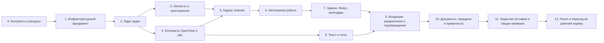

# Poruchik — финальный план реализации по волнам

Статус: `УТВЕРЖДЕНО ДЛЯ ПЛАНИРОВАНИЯ`. Этот документ не разрешает реализацию, изменение кода или рабочего сервера. Он задаёт практически исполнимый порядок после отдельного старта реализации.

Связанные документы: [[01_Системный_промпт]], [[02_Продуктовая_концепция_и_MVP]], [[03_Архитектура_и_потоки]], [[07_Открытые_решения_владельца]].

## 1. Неизменяемые условия

- Продукт и приложение называются **Poruchik**.
- Первая пилотная группа: владелец и один участник.
- Идентификатор Android-пакета: `com.poruchik.app`.
- Первый вход — по одноразовой ссылке; последующий локальный доступ — PIN-код или биометрия.
- Android и Telegram разделяют долговременную память о задачах, но не текущие диалоги.
- Владелец не видит личные задачи участника.
- Повторная передача задачи разрешена только отдельным правом.
- Участник по умолчанию меняет состояние, задаёт вопросы и добавляет результат, но не меняет срок и права доступа.
- Любая созданная агентом задача сначала является предложением.
- Документация в приложении только читается; изменение проходит через OpenClaw, n8n и разрешённый инструмент.
- Исходная голосовая запись удаляется после распознавания; хранится подтверждённый текст.
- Документация для человека ведётся в Obsidian на русском языке.
- Фактическое описание рабочего состояния обновляется только после проверки на рабочем сервере.

## 2. Общая последовательность

## Волна 0. Контрактная фиксация и ресурсный замер

**Цель:** подтвердить, что архитектура помещается на текущем сервере, и заморозить минимальные договоры до параллельной разработки.

**В объёме:**

- фактическая инвентаризация VPS: процессор, память, swap, диск, ввод-вывод, сеть, контейнеры, порты и перезапуски;
- ресурсные лимиты PostgreSQL, n8n, OpenClaw, будущего ядра задач и шлюза;
- модель сущностей, состояний, прав и ошибок;
- черновой договор программного интерфейса (API), правила совместимости версий и уникальные идентификаторы операций;
- реестр внутренних и внешних границ доверия.

**Артефакты:** измеримый ресурсный отчёт, таблица бюджетов, схема данных, договор программного интерфейса (API) версии 1, матрица прав владельца и участника, реестр рисков.

**Зависимости:** утверждённый пакет Poruchik; доступ только на чтение к текущему состоянию сервера.

**RocketFlow:** переносим понятия папки, цели, задачи, Фокуса и календаря. Код не переносим.

**Проверки и доказательства:** снимок ресурсов в покое и под контролируемой нагрузкой; проверка свободного места; список слушающих портов; проверка схемы против всех клиентских путей; отрицательные примеры прав.

**Контрольная точка перехода:** остаётся измеримый запас памяти и процессора, отсутствует риск исчерпания диска; договор API покрывает все восемь решений. Если запас недостаточен, реализация не начинается до расширения VPS или сокращения состава служб.

**Откат и безопасность:** волна только измеряет и проектирует; состояние рабочего сервера не меняется.

**Действия владельца:** только решение об увеличении VPS, если ресурсная контрольная точка не пройдена.

**Параллелизм:** UX-прототипирование и проектирование тестов могут идти параллельно после фиксации сущностей и прав.

## Волна 1. Инфраструктурный фундамент и наблюдаемость

**Цель:** подготовить изолированное место для новых компонентов без переключения пользовательского трафика.

**В объёме:**

- отдельные внутренние службы ядра задач и шлюза;
- закрытая сеть контейнеров, лимиты процессора и памяти, проверки здоровья;
- новые схемы PostgreSQL только добавочными миграциями;
- единый идентификатор запроса от Android до OpenClaw и n8n;
- структурированные журналы без токенов, голоса и закрытого содержимого;
- метрики задержек, ошибок, очередей, ресурсов и удаления временного звука;
- переключатели функций для безопасного включения по частям.

**Артефакты:** инфраструктурные описания, миграции, панели показателей, оповещения и инструкция технического отката.

**Зависимости:** контрольная точка волны 0.

**RocketFlow:** инфраструктурный код не переносится; разрешено сверить рабочие шаблоны миграций и состояния здоровья.

**Проверки и доказательства:** новые порты недоступны извне; служба восстанавливается после перезапуска; журналы не содержат секретов; лимиты реально применены; миграция проходит на пустой базе и тестовой копии схемы.

**Контрольная точка перехода:** тёмный запуск без внешнего трафика стабилен, наблюдаемость показывает каждый запрос и ресурсный бюджет не нарушен.

**Откат и безопасность:** остановка новых контейнеров и удаление внешнего маршрута возвращают исходное состояние; существующие n8n, OpenClaw и Telegram не удаляются.

**Действия владельца:** нет, если не требуется расширение VPS или новый DNS-поддомен.

**Параллелизм:** после готовности тестовой базы параллельно стартуют волны 2 и подготовка Android-сборки из волны 5.

## Волна 2. Серверное ядро задач

**Цель:** создать единственный источник фактического состояния задач, связей, запусков, предложений, входящих и аудита.

**В объёме:**

- модульное серверное приложение;
- сущности рабочей области, личности, задачи, связи задач, назначения, запуска агента, предложения, подтверждения, входящего события, записи Фокуса, метаданных документа и события аудита;
- отдельные состояния задачи и запуска агента;
- контроль версий записей;
- уникальные идентификаторы операций и защита от повторного выполнения;
- курсор изменений для синхронизации;
- добавочные миграции PostgreSQL.

**Артефакты:** схема базы, программный интерфейс ядра, генератор тестовых данных, автоматические модульные и интеграционные проверки.

**Зависимости:** волны 0 и 1.

**RocketFlow:** после отдельного аудита можно перенести изолированные правила дат или чистые доменные модели. Старый мобильный слой и неявные связи не переносятся.

**Проверки и доказательства:** переходы состояний; циклы связей; повтор одного запроса; конфликт версий; удаление доступа; производная задача; независимость задачи от запуска; миграция вперёд и восстановление тестовой копии.

**Контрольная точка перехода:** все операции первой версии выражаются без обхода ядра; повторная доставка не создаёт дубликат; отрицательные проверки прав подготовлены.

**Откат и безопасность:** только добавочные изменения базы; новую запись можно перестать обслуживать старым маршрутом без удаления данных.

**Действия владельца:** нет.

**Параллелизм:** после заморозки интерфейсов параллельно выполняются волны 3, 4 и 5.

## Волна 3. Личность, приглашения и связь Telegram

**Цель:** безопасно связать владельца, одного участника, Android и Telegram с одной внутренней личностью.

**В объёме:**

- одноразовые приглашения с ролью, сроком и отзывом;
- серверные сессии с обновляемыми токенами;
- PIN-код и биометрия только разблокируют локально защищённую сессию и не заменяют серверную проверку;
- Android Keystore для защищённого хранения ключевого материала;
- короткоживущая привязка Telegram;
- раздельные текущие диалоги и общая долговременная память задач;
- завершение сессий и отзыв устройства.

**Артефакты:** интерфейсы входа, приглашения, привязки и отзыва; модель каналов личности; журнал событий безопасности.

**Зависимости:** ядро задач и шлюз.

**RocketFlow:** старую авторизацию и хранение токенов не переносим.

**Проверки и доказательства:** повтор ссылки отклонён; просроченная и отозванная ссылка отклонены; чужой Telegram не связывается; PIN не уходит на сервер; смена биометрии требует повторной серверной проверки; отзыв устройства закрывает доступ.

**Контрольная точка перехода:** владелец и участник входят независимо; канал Telegram корректно связан; роли нельзя повысить запросом клиента.

**Откат и безопасность:** приглашение и сессии отзываются; включение Android-канала управляется переключателем; существующий Telegram остаётся рабочим.

**Действия владельца:** выбрать одного участника пилота; позднее лично выпустить приглашение и связать свой Telegram.

**Параллелизм:** Android-экраны входа и серверные проверки разрабатываются параллельно по зафиксированному договору.

## Волна 4. Контракты OpenClaw и n8n

**Цель:** сделать понимание агента отделённым от прав и фактического исполнения.

**В объёме:**

- структурированный договор намерения OpenClaw → n8n;
- ограниченный контекст задачи и участника;
- инструменты создания предложения, изменения состояния, добавления результата, запроса подтверждения и документа;
- повторная проверка прав в n8n;
- подписанные внутренние вызовы, ограничение времени и повторов;
- доказательство результата инструмента перед сообщением об успехе;
- совместимые коды ошибок для приложения.

**Артефакты:** схемы запросов и ответов, каталог инструментов, матрица риск/подтверждение, тестовый имитатор OpenClaw и n8n.

**Зависимости:** модели волны 2 и правила волны 3.

**RocketFlow:** ничего не переносим; это новая граница Poruchik.

**Проверки и доказательства:** подмена роли; неизвестный инструмент; повтор вызова; превышение времени; ошибка n8n; ложное сообщение об успехе; доступ к чужой задаче; обязательное предложение для любой новой задачи агента.

**Контрольная точка перехода:** ни OpenClaw, ни Android не могут обойти серверную проверку; все существенные действия имеют аудит и подтверждённый результат.

**Откат и безопасность:** новые инструменты выключаются отдельно; старый Telegram-поток остаётся запасным; входные данные ограничены схемой.

**Действия владельца:** утвердить только новые классы рискованных действий, если они появятся сверх текущего объёма.

**Параллелизм:** реализация контрактов идёт параллельно с Android-каркасом.

## Волна 5. Каркас Android и закрытая сборка

**Цель:** получить устанавливаемый безопасный каркас `com.poruchik.app` без бизнес-функций.

**В объёме:**

- Kotlin и Jetpack Compose;
- модули входа, сети, локальной базы Room, синхронизации и функций;
- единая навигация «Задачи / Фокус / Агент / Календарь / Входящие»;
- тема «Тихая бумага»;
- защищённое хранение сессии;
- сборка подписанного внутреннего APK;
- базовая доступность и обработка ошибок.

**Артефакты:** устанавливаемый отладочный APK, автоматическая сборка, экран входа и пустые состояния пяти разделов.

**Зависимости:** договор API, идентификатор пакета и экраны проекта.

**RocketFlow:** можно переносить только согласованные UX-принципы. Старый Android-монолит, сетевой слой и хранение токенов не переносятся.

**Проверки и доказательства:** сборка с нуля; установка на два реальных устройства; поворот, крупный шрифт, экранный диктор; отсутствие секретов в APK; отказ от неверного сертификата сервера.

**Контрольная точка перехода:** приложение устанавливается, входит в тестовую среду и показывает пять разделов без обхода шлюза.

**Откат и безопасность:** функциональные разделы выключены переключателями; ключ рабочей подписи ещё не используется для отладочных сборок.

**Действия владельца:** разрешить установку закрытой тестовой сборки на своём устройстве только на этапе проверки.

**Параллелизм:** оболочка, тема и доступность идут параллельно с сетевым и локальным слоями.

## Волна 6. Автономная работа и синхронизация

**Цель:** обеспечить полезную работу без сети без двойных действий и скрытой потери данных.

**В объёме:**

- локальный кэш задач, календаря, входящих и документов;
- исходящая очередь безопасных изменений;
- уникальные идентификаторы и повтор с задержкой;
- курсор серверных событий;
- контроль версий и явный конфликт;
- автономный черновик текста и голоса;
- запрет автономного подтверждения, изменения прав и передачи.

**Артефакты:** механизм синхронизации, экран ожидающих операций, экран конфликта и набор сценариев потери сети.

**Зависимости:** волны 2, 3 и 5.

**RocketFlow:** старый автономный слой не переносим; переносим только ожидаемое пользовательское поведение задач.

**Проверки и доказательства:** выключение сети в каждой точке; повтор после перезапуска телефона; перестановка операций; один серверный результат; конфликт двух устройств; отозванный доступ во время автономной работы.

**Контрольная точка перехода:** безопасная задача, созданная без сети, появляется на сервере ровно один раз; конфликт и отказ прав видны человеку.

**Откат и безопасность:** очередь можно остановить без удаления локального черновика; опасные типы операций не попадают в неё.

**Действия владельца:** одно ручное испытание в авиарежиме после автоматических проверок.

**Параллелизм:** синхронизация кэша и проектирование экранов задач могут идти параллельно.

## Волна 7. Задачи, Фокус и календарь

**Цель:** реализовать основную ценность продукта до подключения расширенных агентных функций.

**В объёме:**

- личные и доступные совместные задачи;
- папка, цель, задача и подзадача;
- состояния, сроки, связи и ответственный;
- быстрый ввод;
- ограниченный список Фокуса;
- календарное представление;
- отдельное состояние технического запуска агента.

**Артефакты:** экраны списка, карточки, Фокуса и календаря; интерфейсы ядра; автоматические проверки переходов.

**Зависимости:** волны 2, 5 и 6.

**RocketFlow:** переносим продуктовые принципы и, после отдельного согласования, изолированные проверенные правила дат. UI-код целиком не переносим.

**Проверки и доказательства:** создать, изменить, завершить и отменить; часовой пояс Москва; перенос через границу суток; задача без цели; Фокус без дубликатов; задача и запуск имеют независимые состояния.

**Контрольная точка перехода:** владелец и участник управляют своими задачами; личные задачи участника не видны владельцу; календарь и Фокус согласованы с ядром.

**Откат и безопасность:** новые поля добавочны; отключение Android-маршрута не нарушает текущие Telegram-процессы.

**Действия владельца:** оценить удобство быстрого ввода, Фокуса и календаря на реальном телефоне.

**Параллелизм:** список, карточка, Фокус и календарь разрабатываются параллельно при общей модели состояний.

## Волна 8. Текстовые и голосовые команды

**Цель:** дать пользователю два утверждённых способа обращения к агенту.

**В объёме:**

- текстовая команда с видимой областью контекста;
- запись голоса автономно и при сети;
- защищённая временная передача;
- серверное распознавание;
- удаление исходного звука после успеха, ошибки, отмены или истечения временного срока;
- показ и подтверждение распознанного текста;
- сохранение только подтверждённого текста;
- запуск обычного потока OpenClaw → n8n.

**Артефакты:** экран агента, служба распознавания через заменяемый интерфейс, журнал удаления временных файлов без их содержимого.

**Зависимости:** волны 4, 5 и 6.

**RocketFlow:** ничего не переносим.

**Проверки и доказательства:** тишина, шум, длинная команда, отмена, ошибка распознавания, потеря сети, исправление текста; автоматическая проверка отсутствия исходного звука после каждого исхода.

**Контрольная точка перехода:** агент получает только подтверждённый текст; исходный звук отсутствует во временном и постоянном хранилищах; действие не выполняется до подтверждения сомнительного текста.

**Откат и безопасность:** голосовой канал выключается отдельно; текст остаётся доступным; временные файлы имеют принудительную очистку.

**Действия владельца:** разрешить микрофон и выполнить одну безопасную голосовую команду.

**Параллелизм:** интерфейс записи, серверное распознавание и проверки удаления идут параллельно по фиксированному договору.

## Волна 9. Входящие, FCM и подтверждения

**Цель:** сделать изменения и решения устойчивыми даже при потерянном push-уведомлении (системном всплывающем уведомлении).

**В объёме:**

- постоянные входящие с курсором;
- Firebase Cloud Messaging (служба push-уведомлений FCM);
- переход из уведомления к точной задаче или подтверждению;
- категории «Решения / Изменения / Ошибки»;
- кнопки подтверждения и отмены;
- предложение новой задачи с действиями «Принять / Передать / Отклонить»;
- резервная фоновая синхронизация.

**Артефакты:** сервер доставки, Android-каналы уведомлений, карточки входящих, журнал доставки без чувствительного текста.

**Зависимости:** волны 2, 4, 5, 7 и 8.

**RocketFlow:** переносим принцип уведомления и прямого перехода, но не старую реализацию.

**Проверки и доказательства:** запрет уведомлений; потерянное push-уведомление; повторная доставка; устаревшая кнопка; действие с другого устройства; отсутствие секретов в уведомлении; событие остаётся во входящих.

**Контрольная точка перехода:** каждое требующее реакции событие доступно без push-уведомления; подтверждение применяется один раз и только уполномоченным человеком.

**Откат и безопасность:** FCM отключается без потери входящих; подтверждения остаются доступными после обычной синхронизации.

**Действия владельца:** создать или разрешить проект FCM и передать конфигурацию через защищённый канал; разрешить уведомления на пилотных устройствах.

**Параллелизм:** Android-входящие, сервер событий и FCM разрабатываются параллельно.

## Волна 10. Markdown, передача, приватность и согласования

**Цель:** завершить совместную работу и доказать границы доступа.

**В объёме:**

- дерево Markdown-документов, цепочка навигации, внутренние ссылки и автономный кэш;
- отсутствие прямого редактора;
- запрос изменения через OpenClaw → n8n → разрешённый документный инструмент;
- передача целой задачи или связанной подзадачи;
- точечные права на задачу и ветку документов;
- права участника по умолчанию: состояние, вопросы, результат;
- отдельное право повторной передачи;
- подтверждение владельца для спорных действий.

**Артефакты:** просмотрщик документов, модель доступа, экран передачи, экран согласования и набор отрицательных тестов приватности.

**Зависимости:** волны 2, 3, 4, 6, 7 и 9.

**RocketFlow:** переносим связи и подзадачи как понятия. Старые права, редактор и прямую файловую работу не переносим.

**Проверки и доказательства:** владелец не читает личную задачу участника; участник не меняет срок и доступ; повторная передача без права отклонена; OpenClaw не получает соседний контекст; путь `..` и внешние опасные ссылки блокируются; прямой записи Markdown из приложения нет.

**Контрольная точка перехода:** все отрицательные проверки доступа проходят; разрешённая подзадача и её документы видны, всё остальное скрыто.

**Откат и безопасность:** права только сужаются по умолчанию; документные изменения версионируются; модуль передачи выключается отдельно.

**Действия владельца:** подтвердить одну тестовую передачу и одну тестовую операцию согласования.

**Параллелизм:** просмотр Markdown и серверная модель передачи могут идти параллельно; финальная интеграция последовательна.

## Волна 11. Закрытая поставка и общая проверка перед рабочим сервером

**Цель:** получить воспроизводимую, подписанную и наблюдаемую версию-кандидат.

**В объёме:**

- постоянный ключ подписи APK с отдельным восстановительным хранением;
- закрытая HTTPS-страница загрузки;
- манифест версии, минимальная поддерживаемая версия и SHA-256;
- совместимость сервера минимум с текущей и предыдущей версией приложения;
- полный автоматический набор проверок и программная имитация сообщений;
- нагрузочная и ресурсная проверка;
- проверка журналов и метрик.

**Артефакты:** подписанный кандидат, контрольная сумма, ведомость состава, протокол проверок, инструкция установки и отката функций.

**Зависимости:** волны 1–10.

**RocketFlow:** код поставки не переносим.

**Проверки и доказательства:** чистая сборка; совпадение подписи; отклонение APK с чужой подписью; установка и обновление; полный автоматический сквозной путь; отсутствие критических уязвимостей; ресурсный запас.

**Контрольная точка перехода:** кандидат воспроизводим, автоматические проверки зелёные, нет дефектов высокой критичности, ресурсная контрольная точка повторно пройдена.

**Откат и безопасность:** Android нельзя надёжно откатить на меньший номер версии, поэтому сервер сохраняет совместимость, а функции отключаются переключателями; исправление поставляется новой подписанной версией.

**Действия владельца:** сохранить восстановительную копию ключа подписи вне сервера; установить кандидат на два пилотных устройства.

**Параллелизм:** безопасность, доступность, нагрузка и сквозные проверки идут параллельно; решение о выпуске принимается после их объединения.

## Волна 12. Пилот «владелец + один участник» и переход на рабочий сервер

**Цель:** подтвердить всю первую версию на рабочем сервере при минимальном числе ручных действий.

**В объёме:**

- тёмный запуск внутренних компонентов;
- канареечное включение — первое включение только владельцу;
- приглашение одного участника;
- сквозные сценарии текста, голоса, задач, Фокуса, календаря, входящих, документов, передачи и подтверждения;
- проверка приватности двумя реальными личностями;
- наблюдение ошибок и ресурсов;
- постепенное включение Android-канала без отключения Telegram;
- фиксация фактического состояния в Obsidian только после проверки рабочего сервера.

**Артефакты:** протокол проверки рабочего сервера, список фактических версий, подтверждённая схема текущего состояния, журнал известных ограничений и обновлённый пакет Obsidian.

**Зависимости:** контрольная точка волны 11.

**RocketFlow:** никаких новых переносов на этапе переключения.

**Проверки и доказательства:** владелец и участник проходят свои пути; отрицательная проверка приватности; потерянное push-уведомление восстанавливается входящими; автономная синхронизация; голос удалён; предложение агента требует решения; повторная передача без права запрещена; метрики и аудит связывают путь от телефона до результата.

**Контрольная точка завершения:** выполнены все критерии `MVP DONE` (MVP готов), владелец принимает пилот, существенные риски закрыты или явно записаны.

**Откат и безопасность:** выключить Android-маршрут и новые инструменты, сохранить Telegram и данные ядра, вернуть предыдущую совместимую серверную версию; никакого удаления пользовательских данных.

**Действия владельца:** пройти полный ручной список из раздела 8 и принять или отклонить переход на рабочий сервер.

**Параллелизм:** техническое наблюдение и пользовательские проверки идут параллельно; само переключение выполняется одним ответственным последовательно.

## 3. Критический путь

```mermaid
flowchart LR
    A["Ресурсная контрольная точка"] --> B["Инфраструктурный фундамент"]
    B --> C["Ядро задач"]
    C --> D["Личность и права"]
    D --> E["Контракты OpenClaw и n8n"]
    E --> F["Android-каркас"]
    F --> G["Автономная синхронизация"]
    G --> H["Основные задачи"]
    H --> I["Текст, голос и входящие"]
    I --> J["Приватность, документы и передача"]
    J --> K["Подписанный кандидат"]
    K --> L["Owner-canary"]
    L --> M["Пилот: владелец и один участник"]
    M --> N["Рабочая проверка PASS и обновление Obsidian"]
```

Параллельная работа сокращает календарную длительность, но не меняет последовательность контрольных точек: модель прав должна существовать до совместной работы, а документация рабочего состояния — после фактической проверки.

## 4. Порядок изменений рабочего сервера

1. Снять ресурсные показатели без изменений.
2. При необходимости увеличить VPS до установки новых служб.
3. Создать внутреннюю сеть, лимиты и наблюдаемость.
4. Применить только добавочные миграции PostgreSQL.
5. Запустить ядро задач и шлюз без внешнего маршрута.
6. Подключить OpenClaw и n8n за выключенными переключателями.
7. Выполнить автоматические проверки через внутренний интерфейс.
8. Открыть HTTPS-маршрут только для API Poruchik.
9. Выполнить канареечное включение только владельцу.
10. Проверить владельца, затем выпустить одно приглашение участнику.
11. Включить push-уведомления и функции по одной группе.
12. Оставить Telegram рабочим на всём пилоте.
13. После общего PASS обновить Obsidian фактическими версиями, схемой и ограничениями.

## 5. Критерии `MVP DONE`

- Подписанное приложение `com.poruchik.app` устанавливается и безопасно обновляется.
- Одноразовое приглашение нельзя повторить; PIN/биометрия защищают локальный доступ.
- Владелец и один участник связаны с корректными Telegram-личностями.
- Общая долговременная память не смешивает текущие диалоги каналов.
- Личная задача участника недоступна владельцу на уровне API, OpenClaw и документов.
- Member по умолчанию меняет только состояние, задаёт вопросы и добавляет результат.
- Повторная передача без явного права запрещена.
- Все задачи агента сначала создаются как предложения.
- Текст и голос проходят полный путь; исходный звук удаляется; хранится подтверждённый текст.
- Без сети доступны утверждённые функции; повтор не создаёт дубликаты; конфликт показан.
- Задачи, Фокус и календарь согласованы с сервером и часовым поясом Москвы.
- Потерянное push-уведомление не теряет событие во «Входящих».
- Markdown читается деревом и по внутренним ссылкам; прямого редактирования нет.
- Рискованные действия требуют решения владельца и выполняются один раз.
- Внешние порты ограничены; секреты и содержание голоса не попадают в журналы.
- Метрики и аудит связывают запрос Android/Telegram с OpenClaw, n8n и результатом.
- Ресурсная контрольная точка пройдена под пилотной нагрузкой; нет необъяснимых перезапусков и исчерпания диска.
- Нет незакрытых дефектов высокой критичности.
- После успешной проверки рабочего сервера пакет Obsidian обновлён как фактическая документация.

## 6. Сознательно вне MVP

- публикация в Google Play;
- несколько организаций и массовое подключение команды;
- автоматическая установка APK без подтверждения Android;
- прямой редактор Markdown;
- совместное редактирование документов;
- автономные подтверждения и серверные инструменты;
- автоматическое создание активных задач агентом;
- сложная аналитика продуктивности и загрузки команды;
- веб- и настольный клиент;
- видеосвязь;
- универсальная торговая площадка инструментов;
- векторная база только для мобильных функций;
- перенос старого Android-монолита RocketFlow;
- расширенная корпоративная система управления устройствами.

## 7. Оценка трудозатрат

Оценка указана в человеко-часах, а не в календарных сроках. Параллелизм меняет длительность, но не общий объём.

| Волна | Диапазон, человеко-часы |
|---|---:|
| 0. Контракты и ресурсы | 12–20 |
| 1. Инфраструктура и наблюдаемость | 16–28 |
| 2. Ядро задач | 40–72 |
| 3. Личность и приглашения | 28–48 |
| 4. OpenClaw и n8n | 28–48 |
| 5. Android-каркас | 36–64 |
| 6. Автономная синхронизация | 32–56 |
| 7. Задачи, Фокус, календарь | 40–72 |
| 8. Текст и голос | 28–52 |
| 9. Входящие и push-уведомления | 32–56 |
| 10. Документы, передача и приватность | 32–60 |
| 11. Поставка и общая проверка | 32–56 |
| 12. Пилот и переход на рабочий сервер | 24–44 |
| **Итого ориентир** | **380–676** |

Диапазон включает реализацию, автоматические проверки, устранение обнаруженных дефектов и подтверждение рабочего сервера. Он не включает ожидание внешних аккаунтов, закупку ресурсов и расширение объёма.

## 8. Полный список ручных действий владельца

1. Утвердить увеличение VPS, только если не пройдена ресурсная контрольная точка.
2. При необходимости создать DNS-запись для внешнего API Poruchik.
3. Создать или разрешить проект FCM и безопасно передать конфигурацию; не отправлять секреты в чат.
4. Сохранить восстановительную копию ключа подписи APK вне VPS.
5. Выбрать одного участника пилота и его Android-устройство.
6. Установить подписанный кандидат на свой телефон и телефон участника.
7. Разрешить установку из закрытого источника, уведомления и микрофон.
8. Настроить PIN-код или биометрию после приглашения.
9. Выпустить одно приглашение участнику и при необходимости отозвать тестовое.
10. Связать Telegram владельца и участника с правильными учётными записями.
11. Создать личную задачу и убедиться, что второй участник её не видит.
12. Создать совместную задачу и передать подзадачу участнику.
13. Проверить, что участник меняет состояние, задаёт вопрос и добавляет результат, но не меняет срок или доступ.
14. Проверить отказ повторной передачи без отдельного права.
15. Отправить текстовую и голосовую команды; проверить распознанный текст.
16. Подтвердить одну безопасную тестовую операцию и отменить другую.
17. Принять, передать и отклонить по одному предложению задачи агента.
18. Проверить задачу в авиарежиме и последующую синхронизацию.
19. Отключить уведомления или пропустить push-уведомление, затем найти событие во «Входящих».
20. Открыть дерево Markdown и перейти по внутренней ссылке.
21. Подтвердить, что продукт приемлем для пилота, либо перечислить конкретные дефекты.

Все серверные команды, автоматические отрицательные тесты, имитация сообщений, проверка журналов и ресурсов выполняются без ручного участия владельца.

## 9. Самокритика плана

### Технический директор (CTO)

**Обнаруженный риск:** параллельная разработка до фиксации API вызвала бы повторную работу. **Исправление:** введены волна 0 и обязательная заморозка моделей перед волнами 3–5.

**Обнаруженный риск:** новые службы могут не поместиться на текущем VPS. **Исправление:** ресурсная контрольная точка стоит до любой установки и повторяется перед пилотом.

### Лидер тестирования (QA)

**Обнаруженный риск:** общая проверка была бы слишком поздней. **Исправление:** каждая волна имеет собственные отрицательные и сквозные проверки; волна 11 только объединяет уже проверенные вертикали.

**Обнаруженный риск:** ручная Telegram-проверка не покрывает повторы и потери сети. **Исправление:** основное покрытие автоматизировано, владелец выполняет только реальные клиентские действия.

### Безопасность

**Обнаруженный риск:** PIN-код можно ошибочно принять за серверную аутентификацию. **Исправление:** PIN и биометрия только разблокируют локально защищённую сессию; сервер продолжает проверять и обновлять токены.

**Обнаруженный риск:** удаление звука только после успешного распознавания оставляет файлы при ошибке. **Исправление:** удаление обязательно после успеха, ошибки, отмены и истечения временного срока.

**Обнаруженный риск:** административная роль могла бы обойти приватность. **Исправление:** отрицательные проверки доступа владельца к личной задаче участника обязательны на уровне API, OpenClaw и документов.

### Продукт

**Обнаруженный риск:** первая версия могла расшириться до полноценной корпоративной платформы. **Исправление:** пилот ограничен владельцем и одним участником, а масштабирование, редактор, аналитика и публичная поставка вынесены за MVP.

Итог самопроверки: подтверждённые проблемы внесены в последовательность, контрольные точки и критерии готовности. Архитектурных вопросов, блокирующих начало волны 0, не осталось.
