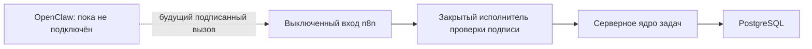

# Poruchik — интеграция OpenClaw и n8n, Wave 4

Статус: `DARK E2E PASS`. Полная внутренняя цепочка проверена на рабочем сервере, после чего оба новых процесса n8n снова выключены. OpenClaw не подключён к новым инструментам, Telegram не переключён.

## Назначение

OpenClaw переводит понятую просьбу человека в одну из строго определённых команд Poruchik. Он не назначает себе личность, роль или права и не выполняет изменения напрямую. n8n принимает подписанную команду, проверяет её форму и передаёт серверному ядру задач. Серверное ядро повторно проверяет права и остаётся единственным источником фактического результата.

## Поддерживаемые команды

Зафиксированы тринадцать команд:

1. создать задачу;
2. изменить задачу;
3. получить список задач;
4. назначить исполнителя;
5. принять или отклонить назначение;
6. получить личный Фокус;
7. изменить личный Фокус;
8. получить календарь;
9. получить входящие события;
10. прочитать разрешённые документы;
11. запросить подтверждение;
12. принять, отклонить или передать предложение;
13. принять или отклонить подтверждение.

Для каждой команды существует строгая схема входных данных и эталонный пример. Модель не может передать в параметрах рабочую область, личность, роль, происхождение команды или идентификатор связи. Эти значения добавляет доверенный серверный контекст.

## Полномочия владельца и участника

Роль сама по себе не расширяет доступ. Мост использует только фактически выданные сервером области полномочий. Поэтому владелец не может прочитать личную задачу участника лишь благодаря роли владельца. Участник может изменить состояние назначенной ему задачи, но не получает права менять срок, содержание или доступ без отдельного разрешения.

OpenClaw не может нажать за человека кнопку решения. Принятие назначения, предложения, подтверждения и изменение Фокуса допускаются только как прямое действие человека.

## Предложения агента

Если агент самостоятельно обнаружил новую работу, команда создания задачи обязательно содержит идентификатор технического запуска. Успешным результатом такой команды считается только ожидающее решение предложение. Ответ, который объявляет инициативу агента сразу действующей задачей, отклоняется как нарушение.

## Подтверждения

Назначение исполнителя требует существующего подтверждения. Инициированное агентом изменение задачи также не проходит без подтверждения. Решение по подтверждению всегда принадлежит человеку; OpenClaw не может сформировать его от имени пользователя.

## Подпись и защита от повторов

Связь OpenClaw → n8n и связь n8n → серверное ядро используют разные идентификаторы служб и разные HMAC-секреты. HMAC — это код проверки подлинности запроса, рассчитанный из секрета и точного содержимого вызова.

Подпись связывает метод запроса, точный внутренний путь, время, одноразовое значение и контрольную сумму полезной нагрузки. Изменение любого элемента делает подпись недействительной. n8n хранит недавно использованные одноразовые значения и отклоняет повтор.

Идентификатор операции передаётся дальше как ключ защиты от повторного выполнения. Одинаковый повтор возвращает прежний результат, а попытка применить тот же идентификатор к другому содержимому отклоняется.

## Версии и ложный успех

Изменение и назначение задачи обязаны содержать ожидаемую положительную версию. Она входит в подписанное тело и контрольный отпечаток операции на стороне серверного ядра.

Ответ считается успешным только при совпадении вида команды, идентификатора связи, идентификатора операции, разрешённого вида результата и фактически возвращённого объекта. Для создания задачи требуется идентификатор созданного объекта. Для инициативы агента требуется состояние ожидающего предложения. Поэтому OpenClaw не может сообщить человеку об успехе на основании одного кода HTTP или неподтверждённого текста модели.

## Аудит

Локальный исполнитель формирует запись с идентификаторами операции и связи, видом команды, рабочей областью, вызывающим человеком, происхождением, результатом и временем начала и завершения. Содержимое пользовательской задачи в эту техническую запись не копируется.

## Транспорт

Публичный HTTPS-маршрут для Android не используется. Мобильное приложение обращается по HTTP только к `127.0.0.1` внутри индивидуального SSH-туннеля. Внутри закрытой сети сервера OpenClaw, n8n и серверное ядро также используют непубличные HTTP-адреса контейнеров. HMAC защищает подлинность внутренних служебных вызовов независимо от этого транспорта.

## Фактическая схема на рабочем сервере

Закрытый исполнитель добавлен потому, что действующая политика n8n запрещает программным узлам читать переменные среды и загружать модуль `crypto`. Политика не ослаблялась: n8n только формирует структурированный конверт запроса, а исполнитель проверяет подпись, время, одноразовое значение, точный путь, контрольную сумму тела и допустимость команды. Затем он подписывает отдельный служебный вызов к серверному ядру.

Исполнитель:

- не имеет опубликованных портов;
- работает от непривилегированного пользователя `65532`;
- имеет файловую систему только для чтения, кроме отдельного журнала использованных одноразовых значений;
- получает секреты из закрытого файла окружения владельца `root` с правами `0600`;
- связан только с внутренними сетями n8n и Poruchik;
- отклоняет подмену личности, неизвестную команду, просроченный запрос, повтор, неверную версию, отсутствие обязательного подтверждения и ложное объявление успеха.

Защита n8n от обращений к внутренним адресам сохранена. В исключение добавлено только точное имя `poruchik-action-executor`; остальные внутренние адреса по-прежнему блокируются.

## Фактическое состояние после проверки

На 1 сентября 2026 года:

- `PoruchikIntentDarkW4` экспортирован с `active: false`;
- `PoruchikApprovalDarkW4` экспортирован с `active: false`;
- OpenClaw не содержит подключённых рабочих инструментов Poruchik и не получает переменную включения Wave 4; фактическое состояние соответствует `false`;
- вход Telegram не переключался;
- закрытый исполнитель, серверное ядро задач, шлюз и n8n находятся в состоянии `healthy`;
- исполнитель не публикует порт на узле;
- тестовые рабочая область, пользователь, аудит и запись защиты от повторного выполнения удалены после проверки.

## Сквозная проверка

Подписанный имитатор прошёл всю цепочку `OpenClaw → n8n → закрытый исполнитель → серверное ядро → PostgreSQL` на рабочем сервере. Положительный сценарий завершён с `PASS`. Все 24 отрицательных сценария были отклонены.

Проверены:

- неверная и изменённая подпись;
- неизвестный служебный ключ;
- просроченное время;
- неверные метод и путь;
- изменение тела после подписи;
- повтор одноразового значения;
- неизвестная команда;
- подмена рабочей области, личности и происхождения;
- решение агента вместо прямого решения человека;
- отсутствие обязательного подтверждения;
- отсутствие версии и идентификатора запуска;
- обязательное предложение для инициативы агента;
- совпадение идентификаторов операции и связи;
- наличие требуемого объекта результата;
- запрет ложного успеха.

Дополнительно исправлена ошибка списка задач без фильтров: PostgreSQL не мог определить тип пустых параметров. Параметры получили явные типы, модульные проверки прошли, исправленный образ серверного ядра развёрнут и сквозной тест повторён успешно.

## Что ещё не включено

Техническая цепочка готова, но рабочий трафик намеренно не включён. Для следующего контрольного шлюза требуется:

1. установить подготовленный адаптер Poruchik отдельным запуском `openclaw-init` с доступным для записи кэшем npm;
2. подтвердить, что признак включения рабочего потока Poruchik изменяется только после успешной проверки;
3. включить два процесса n8n только на время приёмочного переключения;
4. повторить короткую проверку с реальным пользователем;
5. при любой ошибке снова выключить процессы и не менять Telegram.

Ограниченный SSH-контур уже установлен и автоматически проверен; см. [[15_Защищенное_SSH_подключение_рабочего_сервера]]. Текущий единый снимок состояния: [[16_Манифест_текущего_выпуска_2026-09-01]].

## Кодовая и поставочная фиксация

- итоговая версия кода: `b19441e2e14faef27ed039f61ead792aacafafe0`;
- исправление байтов и окончаний строк SSH-пакета `2b9cf970` входит в историю итоговой версии;
- SHA-256 итогового архива: `ed9e08c63eec828249ffe527d99b7118fef43e4b7c7d8be815a051fdf897902c`;
- проверка состава и окончаний строк SSH-пакета: `SSH_RELEASE_PASS`;
- образ закрытого исполнителя: `1ebb1dfdcf3d7485e56c6fba8c509be548d81ec8`;
- образ серверного ядра с исправлением списка задач: `b19441e2e14faef27ed039f61ead792aacafafe0`.
