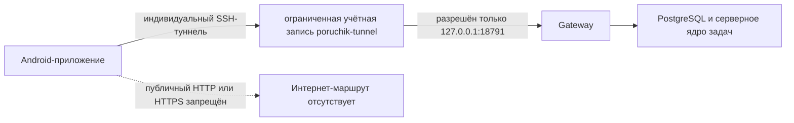

# Защищённое SSH-подключение Android к рабочему серверу

Дата фактической проверки: 2 сентября 2026 года.

Статус: серверная часть — `PASS`; защищённый транспорт на физическом OnePlus 10T через IPv6 — `PASS`; окончательная регистрация приложения ожидает подписи и установки обновлённого APK.

## Фактический мобильный маршрут

На физическом OnePlus 10T с Android API 35 и мобильной сетью МТС установлена причина прежних тайм-аутов. Телефон успешно открывал TCP-соединение к IPv4-адресу VPS, но операторский путь через CGNAT (преобразование общего IPv4-адреса оператора) обрывал TLS-обмен. Ошибка происходила до SSH, Gateway и проверки приглашения. Код приглашения и серверная авторизация не являлись причиной.

У телефона и VPS есть прямой IPv6. Проверка на самом телефоне подтвердила полный транспортный путь:

1. подключение к публичному IPv6 VPS на порту `443`;
2. TLS 1.3 с закреплённым открытым ключом сертификата;
3. выбор специального маршрута HAProxy по имени узла и прикладному протоколу;
4. получение настоящей строки идентификации `SSH-2.0` от ограниченного SSH-сервера.

HAProxy теперь слушает общий порт `443` одновременно на IPv4 и IPv6. Обычный HTTPS продолжает работать на обоих адресах. Временный диагностический порт `4443` удалён. Gateway по-прежнему доступен только через `127.0.0.1:18791`.

## Зачем нужен этот контур

Мобильный программный интерфейс Poruchik не публикуется в Интернете. На сервере шлюз слушает только `127.0.0.1:18791`. Приложение создаёт индивидуальный SSH-туннель, после чего обращается по обычному HTTP к локальному адресу телефона. Внешний путь при этом защищён SSH, а сам шлюз нельзя вызвать напрямую из Интернета.

## Порядок подключения нового устройства

1. Сервер выпускает приглашение с отдельным одноразовым ключом ECDSA P-256 и закреплённым отпечатком ключа VPS.
2. Приложение проверяет отпечаток сервера и выполняет единственную принудительную команду через пользователя `poruchik-bootstrap`.
3. Одноразовый ключ немедленно отзывается. Повторное применение приглашения отклоняется.
4. Приложение передаёт открытый SSH-ключ устройства и открытый ключ прикладного подтверждения ES256.
5. Через короткоживущий туннель приложение обменивает временный токен на прикладную сессию. После этого ключ устройства становится постоянной индивидуальной учётной записью туннеля.
6. Все дальнейшие запросы идут через `poruchik-tunnel` только к `127.0.0.1:18791` и дополнительно требуют прикладную авторизацию.
7. При отзыве устройства его SSH-ключ перестаёт проходить аутентификацию.

## Ограничения SSH

- парольный вход и интерактивная проверка отключены;
- разрешена только переадресация локального порта;
- единственный разрешённый адрес назначения — `127.0.0.1:18791`;
- командная оболочка, псевдотерминал, X11, агент SSH и сетевой туннель запрещены;
- внешний порт Gateway не открыт;
- основной вход администратора `root` не изменён и после перезагрузки конфигурации проверен повторно.

Серверные файлы принадлежат `root`:

| Файл | Режим | SHA-256 |
|---|---:|---|
| `/usr/local/sbin/poruchik-authorized-keys` | `0755` | `0fdd63913a195f5a905350b67489bf3dfce9c696f0082191fdd146930385f8cb` |
| `/poruchik-ssh-bootstrap` | `0755` | `7bef9569f4d94220fbfcefb0fe5591abfef5015e395b6ce10ccb38b535ecf3ec` |
| `/etc/sudoers.d/poruchik-bootstrap` | `0440` | `b0daac4e2fd8fbd8f01afe50ae8ddb662a17d031ca27f6adfbb6936da0204dc5` |
| `/etc/ssh/sshd_config.d/90-poruchik.conf` | `0644` | `57578415c803b6b92d52db93ead6d0ad15557120bff7b78b659e5dd5c1e82523` |

## Доказательства поставки

- единый коммит кодовой базы: `b19441e2e14faef27ed039f61ead792aacafafe0`;
- дерево Git: `26c8a03f13fee53c547ce4ab2af46083775beb1d`;
- коммит исправления окончаний строк: `2b9cf970dc1fbc390a2e21ae384c30d7a42f8e08`, является предком единого коммита;
- SHA-256 полного архива: `ed9e08c63eec828249ffe527d99b7118fef43e4b7c7d8be815a051fdf897902c`;
- локальная и серверная проверки архива подтвердили отсутствие `CR`, нулевых байтов, неправильных окончаний файлов и ошибочных режимов;
- `visudo` и `sshd -t` прошли до установки и после неё;
- конфигурация SSH была перечитана без перезапуска службы;
- отпечаток ключа в защищённой конфигурации Gateway имеет канонический формат OpenSSH и совпадает с фактическим ключом VPS; само значение в отчёт не выводилось.

## Результаты автоматической сквозной проверки

| Проверка | Результат |
|---|---|
| Одноразовый вход по ключу ECDSA P-256 | `PASS` |
| Повторное использование одноразового ключа | отклонено |
| Обмен временного токена на постоянную учётную запись устройства | `PASS` |
| Постоянный туннель и `GET /health/ready` | `PASS` |
| Командная оболочка и псевдотерминал | отклонены |
| X11 и переадресация агента SSH | отклонены |
| Переадресация к адресу вне `127.0.0.1:18791` | отклонена |
| Отзыв устройства через программный интерфейс и новый вход его ключом | отклонён |
| Повторный административный вход `root` | `PASS` |
| Состояние Gateway, серверного ядра, PostgreSQL, n8n и OpenClaw | `healthy` |

Тестовые рабочая область, приглашение, сессия, устройство и служебная личность после проверки удалены. Рабочая SSH-инфраструктура оставлена установленной.

## Что остаётся проверить вручную

- подпись постоянным ключом владельца и установка APK с исправленным IPv6-маршрутом;
- открытие нового IPv6-приглашения физическим Android-телефоном;
- создание неэкспортируемого ключа в Android Keystore;
- восстановление туннеля после остановки приложения, смены сети и перезапуска телефона;
- прикладные сценарии задач, документов, команд агента и подтверждений через этот туннель.

Связанные документы: [[10_Контракты_Wave_0_v1]], [[13_Android_Waves_5_10_Фактическая_реализация]], [[14_Android_Wave_11_Ручной_контрольный_шлюз]].
