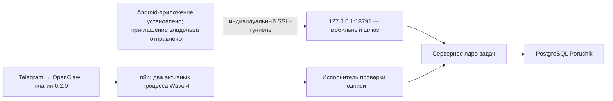

# Poruchik — манифест текущего выпуска

Дата контрольного снимка: 2 сентября 2026 года.

> Обновление транспорта: на физическом OnePlus 10T доказано, что прежний тайм-аут создавал IPv4-маршрут мобильного оператора МТС, а не приложение, SSH или приглашение. Защищённый TLS/SSH-маршрут через прямой IPv6 прошёл на устройстве до получения строки `SSH-2.0`. Серверная конфигурация IPv4+IPv6 установлена; обновлённый APK собран и ожидает ручного ввода пароля постоянного ключа подписи.

Этот документ является главным источником фактического состояния выпуска. Он отделяет установленное и проверенное от подготовленного, но не включённого, и от того, что ещё требует участия владельца.

## Краткий итог

- Серверная основа Poruchik установлена на рабочем VPS и находится в состоянии `healthy` (готова к работе).
- Защищённый путь Android → SSH-туннель → мобильный шлюз прошёл автоматическую сквозную проверку без физического телефона.
- Внутренняя цепочка OpenClaw → n8n → исполнитель проверки подписи → серверное ядро включена и прошла рабочую проверку.
- Android-приложение собрано, подписано постоянным ключом владельца и установлено на физический телефон. Проект Firebase и минимально привилегированная служебная учётная запись FCM подключены; до завершения приглашения телефона отправка уведомлений остаётся корректным бездействием, потому что в базе ещё нет регистрации устройства.
- Плагин OpenClaw `0.2.0` активен: доступны пять прежних инструментов напоминаний и ровно тринадцать инструментов Poruchik.

## Поставочная фиксация

| Артефакт | Зафиксированное значение |
|---|---|
| Версия синхронизации Android и FCM | `43630c607369fbf234cdbb668e0856891e62a26a` |
| Исправления рабочей миграции и запуска | `f45aa75da48f661a203c97c5444d59be3e37c127` |
| Подготовка защищённого каталога Firebase | `675db8ca14ddc67b5e4c74b5528555b337813a93` |
| Запрет попадания файлов Firebase в Git | `945c7134cf9bf84145473ee449eb979778f5fe83` |
| SHA-256 поставочного архива | `ed9e08c63eec828249ffe527d99b7118fef43e4b7c7d8be815a051fdf897902c` |
| Проверенный Android-срез | `43630c6` |
| SHA-256 актуального неподписанного APK с IPv6-маршрутом | `5B306E704942C832FFA55F5A3E62E536E02DFB85F99B560E48374864C2CE407D` |
| SHA-256 подписанного APK с Firebase | `5E473257A49A7EC8C9DAFE77287E97C1BFCCD485BC61B0840B97C7904CA57B5B` |
| Подписанный APK | `C:\BackUp\Poruchik-Signing\Poruchik-MVP-Firebase-release-signed-2026-09-01.apk` |
| Отпечаток сертификата подписи SHA-256 | `4C:A9:2B:E4:B6:68:22:76:BA:E0:78:20:B7:C7:25:AE:D5:F7:AB:9A:F4:8C:9D:F7:C1:62:7B:7E:CC:63:22:4F` |
| Проект Firebase | `poruchik-f90ff` |
| Документ доказательства SSH | коммит базы знаний `6524f67` |
| Документы тёмной HMAC-проверки | коммит базы знаний `ae0b2f9` |
| Адаптер Poruchik для OpenClaw | `d411e9d`, пакет `0.2.0`, установлен и активен |

HMAC — код проверки подлинности внутреннего запроса. Значения секретов, ключей, идентификаторов владельца и приглашений в документацию не записываются.

## Фактические компоненты рабочего VPS

| Компонент | Версия или образ | Состояние | Доступ с узла |
|---|---|---|---|
| `poruchik-gateway` | `poruchik-gateway:f45aa75da48f661a203c97c5444d59be3e37c127` | `healthy` | только `127.0.0.1:18791` |
| `poruchik-task-core` | `poruchik-task-core:f45aa75da48f661a203c97c5444d59be3e37c127` | `healthy` | порт не опубликован |
| `poruchik-action-executor` | `poruchik-action-executor:d64d06034e10683ee5da22f146de44d57ff01e42` | `healthy` | порт не опубликован |
| `poruchik-postgres` | `postgres:17.11-alpine3.24` | `healthy` | порт не опубликован |
| `n8nagents-n8n-1` | `n8n:2.36.7` | `healthy` | только `127.0.0.1:5678` |
| `n8nagents-openclaw-1` | официальный OpenClaw `2026.7.1` | `healthy` | порт не опубликован |
| `n8nagents-postgres-1` | `postgres:17.11-alpine3.24` | `healthy` | порт не опубликован |
| `n8nagents-caddy-1` | `caddy:2.11.4-alpine` | `healthy` | внешний `443`; к мобильному программному интерфейсу Poruchik не ведёт |

На узле снаружи слушают SSH `22` и общий TLS-порт `443` HAProxy на IPv4 и IPv6. HAProxy передаёт обычный HTTPS в Caddy, а защищённый мобильный TLS/SSH — ограниченному SSH-серверу. Службы n8n и мобильного шлюза доступны только через локальный интерфейс. В рабочей базе Poruchik подтверждена ровно одна активная привязка владельца.

## Проверенные контрольные точки

### Защищённое подключение Android

Результат `PASS`:

- одноразовый ключ приглашения принимается один раз и затем отклоняется;
- постоянный индивидуальный туннель до `127.0.0.1:18791` работает;
- оболочка, псевдотерминал, X11, передача агента SSH и переадресация к другим адресам запрещены;
- отзыв устройства прекращает его последующий вход;
- административный вход после установки ограничений сохранён;
- временные приглашение, устройство, сессия и испытательная рабочая область удалены.

Подробности: [[15_Защищенное_SSH_подключение_рабочего_сервера]].

### Рабочая интеграция OpenClaw и n8n

Результат: `PASS` на рабочем сервере.

- плагин `0.2.0` активен; пять инструментов напоминаний сохранены, добавлены ровно тринадцать инструментов Poruchik, четырнадцать запрещённых возможностей остаются запрещены;
- оба процесса Wave 4 активны и имеют активную версию;
- после перезапуска подписанный запрос списка задач возвращает HTTP `200` и используется как фактический признак готовности;
- все 13 инструментов прошли реальный маршрут установленного плагина;
- положительный сценарий и точный повтор прошли, 24 отрицательных сценария подписи, подмены личности, прав, версии и ложного успеха были отклонены;
- точный повтор после перезапуска n8n и исполнителя вернул побайтно тот же ответ и не создал вторую задачу;
- повтор идентификатора операции с изменёнными данными отклонён как `IDEMPOTENCY_KEY_REUSE`;
- личность формируется на сервере и не может быть заменена параметрами модели;
- все восемь контейнеров здоровы, число перезапусков равно `0`; Telegram `getMe` успешен;
- тестовые данные, служебные записи и временные файлы удалены; после очистки подписанная проверка готовности снова прошла;
- технический аудит не содержит запрещённых полей с пользовательским содержимым.

Подробности: [[12_Интеграция_OpenClaw_n8n_Wave_4]].

### Android

Модульные проверки, Android Lint (статическая проверка Android), сборка варианта `release` (сборка для выпуска) и компиляция инструментальных тестов прошли. APK с настройками Firebase подписан постоянным ключом владельца, его подпись версий v2 и v3 проверена, контрольная сумма зафиксирована выше. Владелец установил этот APK на физический телефон.

Реальная синхронизация подключена к жизненному циклу приложения и ручному обновлению экранов. Безопасные изменения задач, фокуса, прочтения уведомлений, черновиков команд и регистрации push-токена ставятся в очередь и отправляются после восстановления SSH-туннеля.

На рабочем сервере применена схема базы версии `6`; подтверждено наличие таблиц `poruchik.push_registrations` и `poruchik.push_deliveries`. Шлюз и ядро задач работают без перезапусков. Через настоящий локальный SSH-перенаправитель `/health/ready` вернул HTTP `200`, а новый маршрут регистрации устройства без токена доступа вернул ожидаемый HTTP `401`, то есть маршрут доступен и защищён.

Минимально привилегированный служебный ключ Firebase размещён в `/opt/poruchik/secrets/firebase/service-account.json`, доступен только `root` и системной группе ядра задач и подключён к контейнеру только для чтения. Получение служебного токена и проверочный запрос FCM без отправки уведомления прошли; ядро задач перезапущено отдельно и здорово. Пока телефон не завершил приглашение и не зарегистрировал FCM-токен, диспетчер уведомлений корректно ничего не отправляет.

Подробности: [[13_Android_Waves_5_10_Фактическая_реализация]], [[14_Android_Wave_11_Ручной_контрольный_шлюз]].

## Проверено на рабочем сервере

- плагин `n8nagents-actions` версии `0.2.0` загружен и активен;
- оба процесса Wave 4 активны;
- серверная обработка всех тринадцати команд Poruchik, защита от повторов и отрицательные проверки завершены;
- службы остаются закрытыми: публичных портов Poruchik нет;
- временные испытательные данные удалены, после очистки готовность подтверждена повторно.

## Что действительно не проверено

- подпись и установка окончательного APK с доказанным IPv6-маршрутом;
- открытие нового IPv6-приглашения приложением и сохранение неэкспортируемого ключа в Android Keystore (защищённом хранилище Android);
- восстановление туннеля после смены сети, остановки приложения и перезапуска телефона;
- реальные текстовые и голосовые команды с телефона;
- фактическая доставка Firebase Cloud Messaging, FCM (служба push-уведомлений Google) после регистрации телефона: проект, клиентская конфигурация и служебный ключ уже подключены, но токен физического устройства ещё не зарегистрирован;
- участие второго пользователя и доказательство приватности на двух физических учётных записях;
- полный физический сквозной путь: приложение → SSH → шлюз → OpenClaw/n8n → серверное ядро → приложение;
- пользовательская проверка всех команд через установленное Android-приложение.

## Следующий шаг

Серверная часть, Firebase и IPv6-транспорт завершены. Следующий шаг — вручную ввести пароль постоянного ключа подписи, установить обновление поверх текущего приложения, после чего выпустить ровно одно новое IPv6-приглашение и завершить физическую сквозную проверку из [[17_Ручной_пакет_завершения_MVP]]. Старые приглашения удалены.
