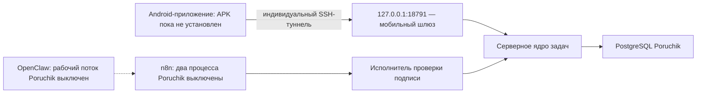

# Poruchik — манифест текущего выпуска

Дата контрольного снимка: 1 сентября 2026 года.

Этот документ является главным источником фактического состояния выпуска. Он отделяет установленное и проверенное от подготовленного, но не включённого, и от того, что ещё требует участия владельца.

## Краткий итог

- Серверная основа Poruchik установлена на рабочем VPS и находится в состоянии `healthy` (готова к работе).
- Защищённый путь Android → SSH-туннель → мобильный шлюз прошёл автоматическую сквозную проверку без физического телефона.
- Внутренняя цепочка OpenClaw → n8n → исполнитель проверки подписи → серверное ядро прошла тёмную проверку: рабочий пользовательский поток при этом не включался.
- Android-приложение собрано в неподписанный APK; установка на телефон ещё не выполнялась.
- Подключение инструментов Poruchik к рабочему OpenClaw не завершено. Действующий Telegram не переключён.

## Поставочная фиксация

| Артефакт | Зафиксированное значение |
|---|---|
| Единая версия исходного кода | `b19441e2e14faef27ed039f61ead792aacafafe0` |
| SHA-256 поставочного архива | `ed9e08c63eec828249ffe527d99b7118fef43e4b7c7d8be815a051fdf897902c` |
| Проверенный Android-срез | `b3d7777` |
| SHA-256 неподписанного APK | `17C2565FC3AC88527E4DEF823342ABF5CE4D60E34D39915D2DD7F13EBD9D0E98` |
| Документ доказательства SSH | коммит базы знаний `6524f67` |
| Документы тёмной HMAC-проверки | коммит базы знаний `ae0b2f9` |
| Подготовленный адаптер Poruchik для OpenClaw | `d411e9d`, подготовлен, но не установлен |

HMAC — код проверки подлинности внутреннего запроса. Значения секретов, ключей, идентификаторов владельца и приглашений в документацию не записываются.

## Фактические компоненты рабочего VPS

| Компонент | Версия или образ | Состояние | Доступ с узла |
|---|---|---|---|
| `poruchik-gateway` | `poruchik-gateway:b19441e2e14faef27ed039f61ead792aacafafe0` | `healthy` | только `127.0.0.1:18791` |
| `poruchik-task-core` | `poruchik-task-core:b19441e2e14faef27ed039f61ead792aacafafe0` | `healthy` | порт не опубликован |
| `poruchik-action-executor` | `poruchik-action-executor:b19441e2e14faef27ed039f61ead792aacafafe0` | `healthy` | порт не опубликован |
| `poruchik-postgres` | `postgres:17.11-alpine3.24` | `healthy` | порт не опубликован |
| `n8nagents-n8n-1` | `n8n:2.36.7` | `healthy` | только `127.0.0.1:5678` |
| `n8nagents-openclaw-1` | официальный OpenClaw `2026.7.1` | `healthy` | порт не опубликован |
| `n8nagents-postgres-1` | `postgres:17.11-alpine3.24` | `healthy` | порт не опубликован |
| `n8nagents-caddy-1` | `caddy:2.11.4-alpine` | `healthy` | внешний `443`; к мобильному программному интерфейсу Poruchik не ведёт |

На узле снаружи слушают SSH `22` и существующий Caddy `443`. Службы n8n и мобильного шлюза доступны только через локальный интерфейс. В рабочей базе Poruchik подтверждена ровно одна активная привязка владельца.

## Проверенные контрольные точки

### Защищённое подключение Android

Результат `PASS`:

- одноразовый ключ приглашения принимается один раз и затем отклоняется;
- постоянный индивидуальный туннель до `127.0.0.1:18791` работает;
- оболочка, псевдотерминал, X11, передача агента SSH и переадресация к другим адресам запрещены;
- отзыв устройства прекращает его последующий вход;
- административный вход после установки ограничений сохранён;
- временные приглашение, устройство, сессия и испытательная рабочая область удалены.

Подробности: [[15_Защищенное_SSH_подключение_рабочего_сервера]].

### Тёмная интеграция OpenClaw и n8n

Результат `DARK E2E PASS`:

- положительный подписанный сценарий прошёл до PostgreSQL;
- 24 отрицательных сценария подписи, повтора, подмены личности, прав, версии и ложного успеха были отклонены;
- после проверки оба процесса n8n Poruchik оставлены с признаком `active: false`;
- тестовые данные и записи защиты от повторов удалены.

Подробности: [[12_Интеграция_OpenClaw_n8n_Wave_4]].

### Android

Модульные проверки, Android Lint (статическая проверка Android), сборка варианта `release` и компиляция инструментальных тестов прошли. Две сборки неподписанного APK дали одинаковую контрольную сумму. APK не подписан и не устанавливался.

Подробности: [[13_Android_Waves_5_10_Фактическая_реализация]], [[14_Android_Wave_11_Ручной_контрольный_шлюз]].

## Неактивная часть OpenClaw

На сервере сохранён действующий пакет инструментов `n8nagents-actions` версии `0.1.3`; он относится к ранее работающему контуру N8NAgents. Признак включения именно нового рабочего потока Poruchik остаётся `false`. Подготовленный адаптер версии `d411e9d` размещён для следующего шага, но в OpenClaw не установлен.

Три попытки активации завершились на этапе инициализации пакета и не переключили рабочий трафик. Следующий согласованный способ — выполнить отдельный запуск `openclaw-init` (инициализатор OpenClaw) с доступным для записи кэшем npm (локальным хранилищем загружаемых пакетов), затем проверить установку и только после успешной проверки включать поток. До этого Telegram и рабочие инструменты Poruchik остаются без изменений.

## Что действительно не проверено

- подпись постоянным ключом владельца и установка APK на физический телефон;
- открытие настоящего приглашения приложением и сохранение неэкспортируемого ключа в Android Keystore (защищённом хранилище Android);
- восстановление туннеля после смены сети, остановки приложения и перезапуска телефона;
- реальные текстовые и голосовые команды с телефона;
- Firebase Cloud Messaging, FCM (служба push-уведомлений Google), и доставка push-уведомлений;
- участие второго пользователя и доказательство приватности на двух физических учётных записях;
- рабочий вызов инструментов Poruchik самим OpenClaw после установки адаптера;
- полный физический сквозной путь: приложение → SSH → шлюз → OpenClaw/n8n → серверное ядро → приложение.

## Следующий шаг

Сначала завершить установку адаптера через отдельный `openclaw-init`, не переключая Telegram до результата `PASS`. Затем выполнить единым пакетом ручные действия из [[17_Ручной_пакет_завершения_MVP]].
