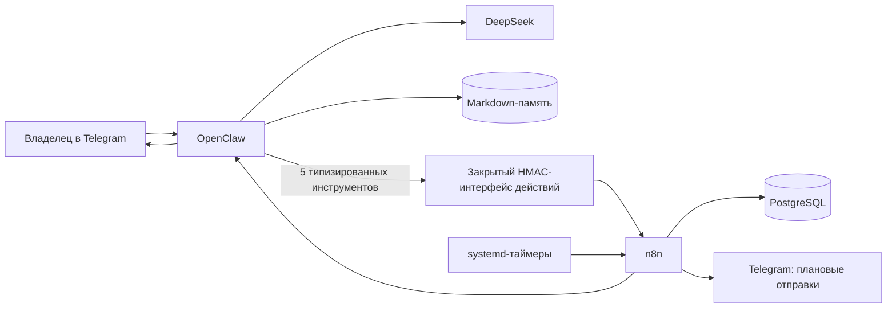

# Архитектура OpenClaw и n8n

Документ начинался как целевой проект. Описанное ядро реализовано и принято на рабочем сервере 31 августа 2026 года; имя файла сохранено для истории. Точные рабочие идентификаторы и границы зафиксированы в [[CURRENT_STATE_N8NAgents_2026-08-29]] и [[Доказательство_OpenClaw_n8n_Production_PASS_20260831]].

## Главный принцип

OpenClaw ведёт разговор и понимает намерение пользователя. n8n принимает только строго описанные команды, проверяет правила и выполняет действия. PostgreSQL хранит надёжное состояние, а Markdown — смысловую память для человека и агентов.

## Компоненты

### OpenClaw

OpenClaw — постоянно работающий диалоговый процесс. Каждый запрос проходит такие этапы:

1. приём сообщения;
2. определение доверенного пользователя и сессии;
3. блокировка сессии, чтобы два сообщения не изменяли её одновременно;
4. сбор контекста, памяти и доступных навыков;
5. обращение к DeepSeek;
6. при необходимости — вызов одного разрешённого инструмента;
7. сохранение результата и отправка ответа.

OpenClaw не является движком строгих деловых процессов. Поэтому операции с последствиями выполняет n8n.

### n8n

n8n — контролируемый исполнительный контур. Он:

- проверяет подпись и отправителя;
- проверяет структуру команды;
- применяет обязательные правила;
- запрашивает подтверждение человека, если оно требуется;
- защищает операции от повторного выполнения;
- обращается к PostgreSQL и внешним службам;
- записывает обезличенный аудит.

### Action API

`Action API` — закрытый программный интерфейс действий между OpenClaw и n8n. Модель не выбирает его адрес и не может передать произвольный URL, SQL или учётные данные.

В рабочем MVP разрешены только:

- `reminder_create` — создать предложение напоминания;
- `reminder_list` — показать напоминания;
- `reminder_cancel` — отменить напоминание;
- `reminder_reschedule` — перенести напоминание;
- `reminder_confirm` — подтвердить предложение кнопкой.

### PostgreSQL

PostgreSQL — главный источник истины для задач, напоминаний, подтверждений, повторов и аудита. OpenClaw не получает прямой доступ к таблицам.

### Markdown-память

Markdown хранит факты, предпочтения и итоги, которые должны быть понятны человеку и агентам. Секреты туда не записываются. Ссылки между заметками позволяют собирать контекст без жёсткой структуры.

## Границы доверия

1. Telegram-сообщение недоверенно до проверки идентификатора пользователя и чата.
2. DeepSeek не определяет права и не выбирает получателя.
3. OpenClaw может вызвать только зарегистрированный инструмент с ограниченной схемой полей.
4. n8n повторно проверяет подпись, отправителя и допустимость операции.
5. PostgreSQL и служебные панели не доступны из интернета.
6. Все секреты хранятся на сервере и не попадают в модель, Git или Obsidian.

Публичный Caddy возвращает `404` для внутренних путей Action API и обоих планировщиков. Прежний Telegram-вход n8n и старые планировщики неактивны.

## Почему это разделение полезно

OpenClaw можно развивать как гибкого помощника, не ослабляя контроль над действиями. n8n остаётся предсказуемым: одна и та же команда проходит одни и те же проверки независимо от формулировки пользователя.

## Будущий многопользовательский режим

Архитектура предусматривает одного владельца-администратора и нескольких участников команды. Личные и командные потоки, задачи и память должны быть изолированы. Права определяет n8n по доверенной роли, а рискованные и спорные действия переходят в очередь согласования владельца и не выполняются до его решения.

Полная целевая модель: [[Многопользовательская_модель_OpenClaw_n8n_TARGET_2026-08-30]].

## Автоматическая сквозная проверка

Полный путь Telegram проверяется отдельным обычным тестовым аккаунтом, которым управляет одноразовый тестовый контейнер через клиентский Telegram API. Второй бот для этого не подходит, потому что Telegram не передаёт ботам сообщения других ботов. Сценарий отправляет реальные сообщения, нажимает кнопки, перезапускает OpenClaw, ждёт плановое уведомление и сверяет состояние PostgreSQL.

Подробности: [[Автоматическая_E2E_проверка_Telegram_TARGET_2026-08-30]].

Связанные документы: [[Потоки_OpenClaw_n8n_TARGET_2026-08-30]], [[Интеграции_OpenClaw_n8n_TARGET_2026-08-30]], [[Безопасность_OpenClaw_n8n_TARGET_2026-08-30]].
