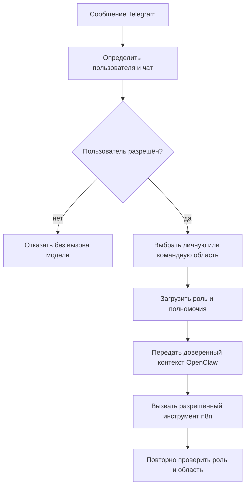
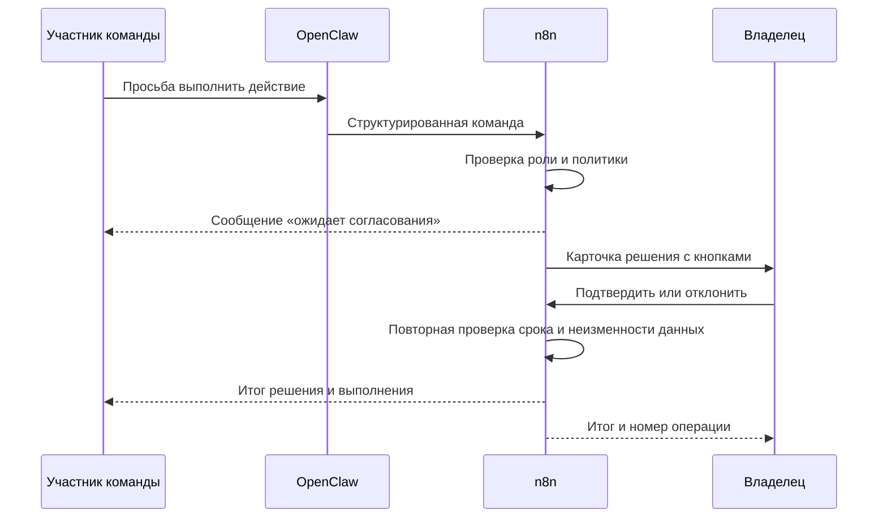

# Многопользовательская модель N8NAgents

Документ заранее проектирует работу владельца и команды через одного Telegram-бота. Это целевая модель, а не действующий функционал.

## Цель

- владелец сохраняет полный административный контроль;
- сотрудники общаются с тем же ботом из своих личных чатов;
- личные данные владельца не смешиваются с командными;
- каждый сотрудник видит только разрешённые задачи и сведения;
- спорные и рискованные действия ожидают решения владельца;
- n8n остаётся единственным контуром, который применяет права и согласования.

## Роли

| Роль | Кто | Возможности по умолчанию |
|---|---|---|
| Владелец-администратор | Только владелец системы | Все личные и командные возможности, управление участниками и ролями, подтверждение спорных действий, просмотр аудита |
| Участник команды | Разрешённый сотрудник | Диалог, свои задачи, разрешённые командные задачи и безопасные инструменты в пределах назначенной роли |
| Наблюдатель | При необходимости | Просмотр разрешённых командных данных без изменения |
| Служебный процесс | OpenClaw, n8n и планировщики | Только технические действия по заранее выданным полномочиям; не является человеком и не получает права администратора |

Новые роли и полномочия добавляются только явной конфигурацией. Отсутствующее разрешение означает запрет.

## Разделение областей

### Личная область владельца

- личные разговоры;
- личная Markdown-память;
- личные задачи и напоминания;
- административные команды;
- запросы на согласование.

Ни один участник команды не получает доступ к этой области.

### Личная область сотрудника

- отдельная история разговора;
- личные рабочие задачи сотрудника;
- личные предпочтения, разрешённые политикой организации;
- результаты его собственных запросов.

Другие сотрудники не видят эту область без отдельного права.

### Командная область

- общие задачи и поручения;
- общие регламенты и знания;
- состояние командных процессов;
- результаты, которые явно опубликованы для команды.

Запись в командную память и изменение общих данных требуют отдельного разрешения роли.

## Идентификация и маршрутизация

Каждое сообщение получает доверенный контекст до обращения к DeepSeek:

- `actor_id` — кто отправил сообщение;
- `chat_id` — из какого чата оно пришло;
- `workspace_id` — личная или командная область;
- `role_id` — назначенная роль;
- `scopes` — конкретный перечень разрешённых возможностей;
- `conversation_id` — изолированный поток разговора.

Эти значения формирует программа из списка участников. Языковая модель не может подменить их текстом сообщения.

## Модель данных

Командные таблицы должны явно хранить:

- владельца записи;
- автора создания;
- рабочую область;
- видимость;
- назначенных исполнителей;
- требуемый уровень согласования;
- состояние согласования;
- автора и время решения;
- версию политики, по которой принято решение.

Все запросы к задачам фильтруются по пользователю, рабочей области и роли. Одного фильтра по Telegram-чату недостаточно.

## Согласование владельцем

### Когда требуется

Согласование обязательно для действий, которые политика помечает как рискованные или спорные, например:

- отправка данных наружу;
- изменение общей командной информации;
- назначение или снятие прав;
- действие с расходами;
- массовая операция;
- удаление или необратимое изменение;
- действие, вышедшее за обычный лимит участника.

### Как проходит

Карточка владельца должна показывать: инициатора, действие, объект, последствия, срок действия запроса и причину согласования. Секреты и лишние персональные данные не показываются.

## Правила согласования

- Решение может принять только владелец-администратор.
- Кнопка привязана к конкретному владельцу, операции и неизменяемой контрольной сумме данных.
- Изменение параметров после запроса согласования делает старое решение недействительным.
- Повторное нажатие не выполняет операцию второй раз.
- Запрос имеет срок действия и после него закрывается.
- До положительного решения действие не выполняется.
- Отклонение требует необязательного комментария владельца.
- Инициатор видит состояние: ожидает, подтверждено, отклонено, истекло или выполнено.

## Память и защита от утечек

Память разделяется физическими или логическими пространствами имён:

- `personal/<user_id>` — личная память конкретного человека;
- `team/<workspace_id>` — общая память команды;
- `admin/<owner_id>` — административная память владельца.

OpenClaw загружает только память текущей области. Результат из личной области не переносится в командную автоматически. Публикация в общую память является отдельным действием с проверкой права.

## Управление участниками

Добавление человека выполняет владелец:

1. получает Telegram-идентификатор безопасным способом;
2. создаёт приглашение с ограниченным сроком;
3. назначает роль и рабочую область;
4. человек подтверждает свой чат;
5. n8n активирует запись участника и пишет аудит.

Удаление участника немедленно отзывает его полномочия, но не стирает историю операций.

## Безопасные значения по умолчанию

- только личные Telegram-чаты; групповые чаты проектируются отдельно;
- участник видит только собственные задачи и явно общие задачи;
- создавать общую задачу можно только при отдельном разрешении;
- все расходы, внешние отправки и удаления требуют решения владельца;
- участник не может приглашать других людей;
- DeepSeek не принимает решения о правах;
- n8n повторно проверяет каждое действие независимо от ответа OpenClaw.

## Этапы будущего внедрения

1. Таблицы участников, ролей, полномочий и рабочих областей.
2. Привязка Telegram-пользователя к роли.
3. Изоляция разговоров и памяти.
4. Проверка полномочий в Action API.
5. Очередь согласований и кнопки владельца.
6. Фильтрация задач по владельцу, исполнителю и области.
7. Отрицательные тесты на утечку между пользователями.
8. Ограниченный запуск с одним сотрудником.
9. Проверка аудита и отзыва доступа.
10. Только после успешной проверки — расширение на команду.

## Критерии приёмки

- неизвестный пользователь не доходит до DeepSeek;
- два участника не видят личные разговоры и задачи друг друга;
- участник не может вызвать административный инструмент;
- рискованное действие не выполняется без владельца;
- чужая кнопка согласования отклоняется;
- изменение операции после согласования невозможно;
- повтор не создаёт второго действия;
- владелец видит полную очередь ожидающих решений;
- отзыв доступа действует сразу;
- аудит показывает инициатора, решение и результат без секретов.

## Вопросы перед реализацией

Перед внедрением потребуется отдельно утвердить:

1. Будут ли сотрудники общаться только в личных чатах с ботом или также в группах.
2. Какие начальные роли нужны кроме владельца и обычного участника.
3. Какие сведения считаются общими для команды.
4. Какие действия всегда требуют согласования владельца.
5. Может ли участник создавать личные напоминания без согласования.

Связанные документы: [[Архитектура_OpenClaw_n8n_TARGET_2026-08-30]], [[Безопасность_OpenClaw_n8n_TARGET_2026-08-30]], [[Потоки_OpenClaw_n8n_TARGET_2026-08-30]].
