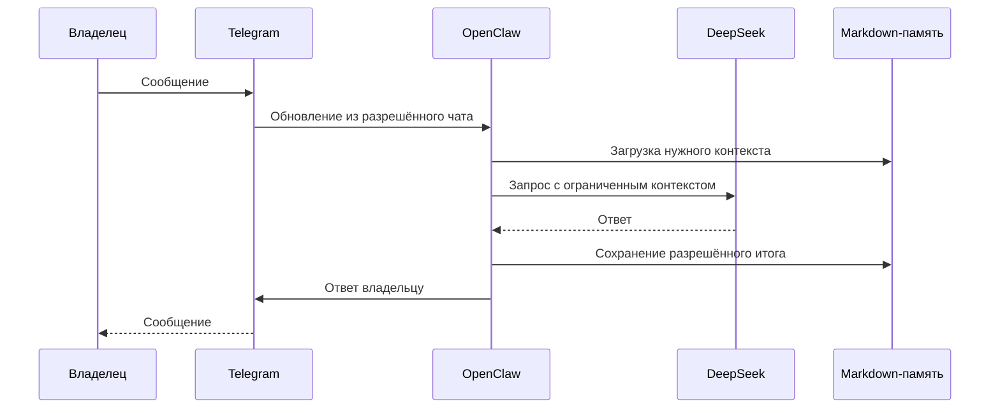
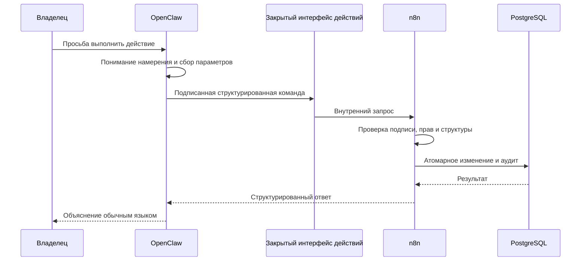
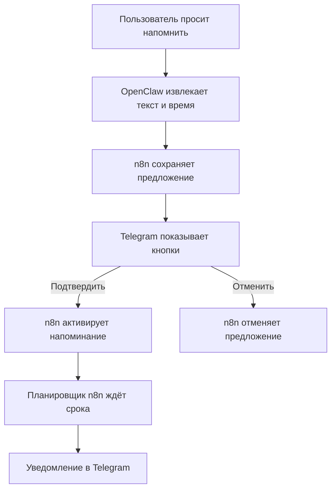

# Потоки OpenClaw и n8n

## Обычный разговор

## Действие через n8n

## Напоминание с подтверждением

## Перенос срока

Если пользователь переносит напоминание, система уточняет новое время и, при необходимости, частоту повторных напоминаний до подтверждения переноса. Изменение выполняется только после однозначного выбора нужной задачи.

## Защита от повторов

Каждый вызов действия содержит уникальный ключ. Повтор того же запроса возвращает прежний результат и не создаёт вторую задачу. Повтор с тем же ключом, но другими данными, отклоняется как конфликт.

## Ошибка и откат

Если OpenClaw не проходит проверку после переключения, он останавливается, прежний вход Telegram возвращается в n8n, а PostgreSQL и существующие задачи сохраняются.

Связанные документы: [[Архитектура_OpenClaw_n8n_TARGET_2026-08-30]], [[Безопасность_OpenClaw_n8n_TARGET_2026-08-30]].
