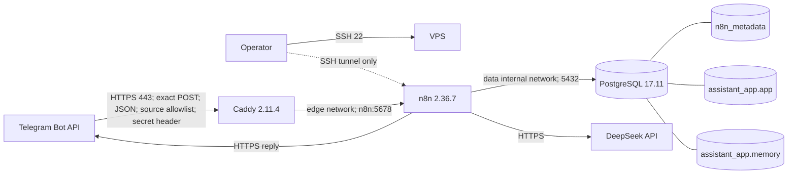
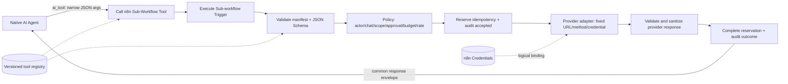
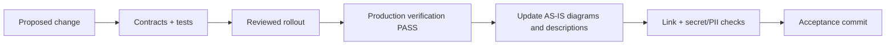

> [!important] Canonical placement and source status
> Полный human-readable source document перенесён в canonical Obsidian vault. Source path указан только как provenance и может быть удалён из repository. Current canonical architecture: [[Архитектура_AS_IS_и_API_Tools_N8NAgents]].
>

# N8NAgents: production AS-IS and custom API tools

Last production verification: **2026-08-29, PASS**. This document contains no secret values, credential IDs, Telegram identifiers, public address, or message bodies. Runtime facts are redacted but were read from the production host, n8n metadata, and PostgreSQL. Repository-only statements are explicitly marked.

## Status language

| Mark | Meaning |
|---|---|
| **VERIFIED AS-IS** | Observed in production on the date above or confirmed by the completed production acceptance test. |
| **REPOSITORY SPEC** | Present in versioned schemas/specifications, but not sufficient evidence that the behavior is active in production. |
| **PLANNED / RECOMMENDED** | Target design; not current functionality. |
| **UNKNOWN** | Not proven with acceptable production evidence. |

AS-IS is never updated from intention, a draft export, or a successful local test. It changes only after production verification PASS.

## Participants and flows

| Participant | Trust / responsibility | Current interaction |
|---|---|---|
| Telegram user and chat | Untrusted input until deterministic authorization; the reply destination is never model-selected. | Sends one supported text message and receives bounded plain-text chunks. |
| Telegram Bot API | External provider. | Delivers a webhook with the Telegram secret header; accepts replies only for the normalized original chat. |
| Caddy | Public trust boundary and TLS terminator. | Admits only the exact Telegram route, source networks, JSON content type, secret header, method, and body size. |
| n8n `01_telegram_assistant` | Active application orchestrator. | Normalizes and authorizes, claims the update, calls DeepSeek, uses PostgreSQL memory, reserves outbound attempts, replies, and completes/fails the update. |
| DeepSeek | External LLM; output is untrusted. | Current production path uses the native DeepSeek model with `deepseek-chat`. |
| PostgreSQL `n8n_metadata` | n8n-owned metadata boundary. | Stores workflows, encrypted credential records, and n8n metadata. |
| PostgreSQL `assistant_app.app` | Deterministic application state and effects. | Stores update state, outbound budget/attempts, notes, reminders, idempotency, and sanitized audit. |
| PostgreSQL `assistant_app.memory` | Chat-memory boundary. | Stores LangChain chat messages partitioned by a trusted session key. |
| Operator | Privileged human. | Binds credentials, allowlists and release configuration; performs promotion, verification, rollback, and KB acceptance. |
| Custom API provider | **PLANNED** external capability. | Receives only a schema-valid, policy-approved request through a named tool adapter. |

## Runtime flows

### Component and network topology — VERIFIED AS-IS



| Service | Image/version observed | Networks | Host exposure | Runtime controls observed |
|---|---|---|---|---|
| `caddy` | `caddy:2.11.4-alpine` | `edge` | Public TCP 443 on the approved IPv4; no public 80 listener | healthy; read-only rootfs; 160 MiB; 0.5 CPU; 100 PIDs; `unless-stopped`; drops all capabilities and adds only bind-service capability by design |
| `n8n` | `docker.n8n.io/n8nio/n8n:2.36.7` | `edge`, internal `data` | `127.0.0.1:5678` only | healthy; 768 MiB; 1.25 CPU; 300 PIDs; `unless-stopped`; persistent n8n state/files volumes |
| `postgres` | `postgres:17.11-alpine3.24` | internal `data` | none | healthy; 448 MiB; 0.75 CPU; 200 PIDs; `unless-stopped`; persistent database volume |

Only SSH, HTTPS 443 on the approved public IPv4, and loopback n8n 5678 were observed among the application-relevant listeners. PostgreSQL 5432 is not published. IPv6 exposes SSH but not the application HTTPS listener in the observed state. Image tags were observed at runtime; immutable runtime digests were not independently reverified and are therefore **UNKNOWN**. Digest values recorded elsewhere as local/parity pins are not production `docker inspect` evidence.

### Telegram message path — VERIFIED AS-IS

```mermaid
sequenceDiagram
    participant T as Telegram
    participant C as Caddy
    participant W as 01_telegram_assistant
    participant P as PostgreSQL
    participant D as DeepSeek
    participant M as Memory

    T->>C: POST /webhook/telegram-assistant
    C->>C: TLS + public-IP vhost + source networks + JSON + 1 MB + secret header
    C->>W: Forward; replace spoofable X-Forwarded-* headers
    W->>W: Webhook Header Auth
    W->>W: Normalize and Authorize user + chat allowlists
    W->>P: Atomic claim (bot_id, update_id)
    alt duplicate / unavailable lease
        W-->>T: Safe acknowledgement; no repeated model/send effect
    else claimed
        W->>W: DeepSeek binding gate selects native
        W->>M: Load trusted session, window 20
        W->>D: Native DeepSeek request (deepseek-chat)
        D-->>W: Untrusted assistant text
        W->>W: Split near 3500 Unicode code points
        loop each reply chunk
            W->>P: Reserve shared outbound attempt
            W->>T: Send to normalized original chat
        end
        W->>P: Complete update or conservatively fail/dead-letter
        W-->>T: HTTP acknowledgement
    end
```

The production Caddy route uses a direct public-IP HTTPS vhost with a Let's Encrypt short-lived certificate profile, disables automatic HTTP redirects, has no admin endpoint, strips/replaces forwarded headers, and returns `404` for every nonmatching request. A request must satisfy all of: exact POST path, strict JSON content type, 1 MB maximum body, Telegram source-network allowlist, and the server-held secret header. n8n then checks the same logical header-auth credential at the Webhook node boundary.

`Normalize and Authorize` accepts only the intended Telegram text update shape, derives trusted numeric actor/chat/bot/update/message context and session key, and applies both user and chat allowlists before database, memory, model, or effect access. All identity and destination values are fixed expressions from that node, never `$fromAI()`.

The A/B memory acceptance test passed: one update produced one execution/reply path, and the following message correctly recalled the previously supplied control word. Operator acceptance ended at **2/20** outbound attempts. A later read-only database snapshot at `2026-08-29T12:29:31Z`, after subsequent requests, showed four completed update rows, four reserved outbound attempts against a hard cap of twenty, and eight memory rows in one redacted session. Thus **2/20** is the A/B acceptance checkpoint and **4/20** is the later cumulative snapshot; neither mutable counter is a permanent configuration fact.

### Main workflow branches — VERIFIED AS-IS

The active provider binding is `provider_mode=native`, model `deepseek-chat`. `Trusted Session Memory` is Postgres Chat Memory v1.4 with `sessionIdType=customKey`, trusted `session_key`, table `memory.n8n_chat_histories`, and context window 20. It is connected to `Native AI Agent` by `ai_memory`; `Native DeepSeek Model` is connected by `ai_languageModel`.

The workflow also contains a disabled-by-binding deterministic fallback branch: strict DeepSeek HTTP call with a 30-second timeout and redirects disabled, strict router parsing, an allowlisted switch, and calls to five named tool sub-workflows. It is present but is not the selected production branch.

**Important current limitation:** the production `workflow_entity.connections` graph contains `ai_languageModel` and `ai_memory` edges into the native AI Agent, but no `ai_tool` edge; the production binding node selects `provider_mode=native`. The verified structural facts are the selected native branch and absence of an `ai_tool` edge. The resulting reachability conclusion is that the active native path currently provides conversation and memory but cannot invoke the five note/reminder tools. Those workflows exist in production and the unselected fallback router is wired to them, which is not equivalent to model-facing tool functionality on the selected path.

### Error, idempotency, retry, and rollback behavior

- **VERIFIED AS-IS:** unique Telegram update identity is `(bot_id, update_id)` with states `received → processing → completed|failed|dead_letter`, bounded attempts and leases. Completed duplicates are suppressed. No transaction spans a network call.
- **VERIFIED AS-IS:** outbound sends require a unique reserved attempt and consume a shared durable budget. Uncertain Telegram delivery is recorded conservatively; two earlier test rows were dead-lettered with the stable code `TELEGRAM_DELIVERY_UNCERTAIN`. Exactly-once delivery is not claimed.
- **VERIFIED AS-IS:** main failures are sanitized, persisted with stable codes, and return bounded retryable/suppressed responses. Successful and error execution payload persistence is configured off; pruning is enabled with age 168 hours and maximum 10,000 records.
- **REPOSITORY SPEC:** tool functions use `(trusted actor, operation, idempotency key)` plus SHA-256 payload hash. Same key/same payload returns the stored result; same key/different hash conflicts.
- **VERIFIED AS-IS:** containers use `unless-stopped`; volumes retain state. Release state includes a prior release/mode and rollback scripts. Operational rollback is stop ingress or n8n first, preserve PostgreSQL/volumes, restore the compatible release/config, then verify health/listeners. Never use `down -v`, drop databases, or replace the n8n encryption key during ordinary rollback.
- **UNKNOWN:** automated alert delivery and off-host backup/restore acceptance were not re-proven in this verification. Treat the repository backup design as a plan until current production evidence says otherwise.

## Workflow catalogue — VERIFIED AS-IS

Eight workflow records exist; only one is active.

| Workflow | Active | Current function / status |
|---|---:|---|
| `01_telegram_assistant` | yes | Production webhook, trust gate, idempotency, native DeepSeek, PostgreSQL memory, outbound budget, Telegram reply. |
| `tool_save_note` | no | Sub-workflow contract: validate/canonicalize/hash, narrow DB API, common envelope. Not reachable from the selected native agent path. |
| `tool_search_notes` | no | Same pattern; actor/chat-scoped bounded search. Not reachable from the selected native agent path. |
| `tool_list_notes` | no | Same pattern; actor/chat-scoped bounded list. Not reachable from the selected native agent path. |
| `tool_create_reminder` | no | Same pattern; creates a scheduled reminder through a narrow DB function. Not reachable from the selected native agent path. |
| `tool_list_reminders` | no | Same pattern; actor/chat-scoped bounded list. Not reachable from the selected native agent path. |
| `reminder_dispatcher` | no | Scheduled claimant/sender with leases, outbound reservation, success/failure finalization. Imported but inactive. |
| `error_handler` | no | Internal sanitized error envelope and append-only error audit. Imported but inactive. |

In n8n, an inactive trigger workflow is different from a sub-workflow being invoked explicitly. This document reports the database `active` flag and separately reports reachability from the selected main branch.

## Credentials and secret boundaries — VERIFIED AS-IS

Only logical references belong in Git, diagrams, exports, tickets, and chat:

| Logical reference | Bound use |
|---|---|
| `Telegram webhook secret` | Caddy secret-file matcher and n8n Webhook Header Auth boundary. |
| `Telegram account` | Send only to trusted original chat and, when approved/active, reminder dispatcher. |
| `DeepSeek account` | Native DeepSeek model; fallback must bind an equally narrow credential. |
| `Postgres assistant runtime` | Main deterministic update/budget APIs and the five narrow tool workflows. |
| `Postgres memory runtime` | `memory.n8n_chat_histories` only. |
| n8n metadata database binding | Container-only `n8n_runtime@n8n_metadata`; not a workflow credential. |

Secret values are mounted from root-controlled files or stored encrypted by n8n. Credential database IDs, tokens, headers, numeric allowlists, public address, and user/chat/session identifiers must never be documented. Do not use decrypted credential exports for routine inspection.

Security-related n8n configuration observed or defined by the running release includes: community packages off; node environment access blocked; SSRF protection on; public API and Swagger off; diagnostics/templates/version notifications off; Execute Command and read/write-file nodes excluded; successful/error/manual execution payload storage off; file access restricted; Node heap bounded. The editor remains reachable only on loopback/SSH tunnel in the observed listener topology.

## Database model — VERIFIED AS-IS

### Databases, schemas, and roles

| Boundary | Owner/runtime | Effective purpose |
|---|---|---|
| `n8n_metadata.public` | `n8n_runtime` login | n8n metadata and encrypted credential records. Only this role connects for n8n service metadata. |
| `assistant_app.app` | `assistant_owner` NOLOGIN; `assistant_runtime` LOGIN | Application tables and fixed `SECURITY DEFINER` APIs. Runtime has schema usage and execute on approved functions, not generic direct table DML. |
| `assistant_app.memory` | `memory_owner` NOLOGIN; `memory_runtime` LOGIN | Chat history. Runtime has table `SELECT`/`INSERT`/`DELETE` and sequence `USAGE`, plus schema `CREATE` solely because the n8n memory node issues `CREATE TABLE IF NOT EXISTS`. Table `UPDATE`, sequence `SELECT`, and schema `CREATE` outside `memory` are denied. Search path is `memory, pg_catalog`; no public fallback. |

All five project roles are non-superuser, cannot create roles/databases, cannot replicate, and cannot bypass RLS; owner roles cannot log in. Cross-database connections and TEMP privileges are revoked according to role purpose. `public` schema CREATE is revoked except for n8n inside its own metadata database.

### Application objects observed

| Object | Purpose |
|---|---|
| `app.telegram_updates` | Unique inbound update claim, lease, attempts, completion/failure/dead-letter state. |
| `app.telegram_outbound_budget` | Mutable shared production send counter and hard cap. |
| `app.telegram_outbound_attempts` | Unique reservation per outbound effect, source and trusted exact chat. |
| `app.idempotency` | Tool reservation, hash conflict protection, cached result, expiry. |
| `app.notes` | Actor/chat-scoped notes with soft deletion and size checks. |
| `app.reminders` | Actor/chat-scoped reminder state, leases, retry/dead-letter and uncertain-delivery fields. |
| `app.tool_audit` | Sanitized append-only tool audit; UPDATE/DELETE rejected by trigger. |
| `app.workflow_error_audit` | Sanitized workflow error codes and correlation data. |
| `app.schema_migrations` | Applied migration version/checksum. |
| `memory.n8n_chat_histories` | LangChain messages by trusted session key. |

Approved application functions observed include update claim/complete/fail; outbound reservation; reminder claim/sent/failure; sanitized error recording; and the five named note/reminder tool APIs. Generic SQL is not a model-facing capability.

## Current functional capability and limitations

**Works now:** authenticated allowlisted Telegram text chat; replay suppression; bounded shared send budget; native DeepSeek reply; user-confirmed single-session PostgreSQL recall with a 20-message context window; trusted reply destination; Unicode chunking; conservative delivery uncertainty. Persistence across an n8n/PostgreSQL restart and isolation between two session keys are **UNKNOWN — not tested** by the accepted A/B sequence.

**Present but not active end-to-end:** note save/search/list; reminder create/list; reminder delivery schedule; centralized error-handler trigger; deterministic fallback router. These workflows and database APIs exist, but current native-agent tool reachability or trigger activation is absent.

**Not provided:** arbitrary HTTP/URL, SQL, shell, filesystem, code execution, credential selection, workflow ID selection, arbitrary recipient choice, payments, destructive operations, or generalized autonomous browsing. Files/albums/callbacks/edited/channel updates are outside the current Telegram input contract.

## TARGET: embedding our own API-calling tools

### Principle

Do not give the model a generic HTTP Request node. Each external API capability becomes one named, versioned tool with a fixed destination class, fixed credential binding, strict JSON Schema input/output, deterministic policy, idempotency, sanitized audit, and a bounded error envelope. Identity, tenant, recipient, URL, HTTP method, credentials, timeout, and spend policy are supplied by trusted configuration—not model arguments.

### Tool architecture



For native tool use, add one `Call n8n Sub-Workflow Tool` v2.2 node per approved tool and connect each to `Native AI Agent` using `ai_tool`. Do not route from an LLM-provided workflow ID. The current fallback switch may remain a separately tested compatibility path, but both paths must call the same sub-workflow contract.

### Registry / manifest

Add a versioned, secret-free registry, for example `tools/registry.yaml`:

```yaml
apiVersion: n8nagents.tools/v1
tools:
  - name: tool_weather_current
    version: 1.0.0
    workflowKey: tool_weather_current_v1
    description: Read current weather for an approved location query.
    inputSchema: contracts/tools/weather-current.request.schema.json
    outputSchema: contracts/tools/weather-current.response.schema.json
    credentialRef: weather_provider_prod
    providerPolicyRef: weather_readonly_v1
    sideEffect: read
    timeoutMs: 10000
    maxAttempts: 2
    rateLimit: { scope: actor, requests: 10, windowSeconds: 60 }
    cost: { unit: request, hardLimitRef: weather_daily_budget }
    dataClass: public
```

`workflowKey`, `credentialRef`, and policy references are allowlisted deployment bindings. They are never accepted from the tool request. Registry validation must reject duplicates, unknown fields, unpinned schema versions, missing tests, unsafe side-effect defaults, arbitrary URLs, or absent ownership.

### Common request and response contract

Reuse and extend the existing `contracts/tool-request.schema.json` and `contracts/tool-response.schema.json`. The parent supplies trusted fields; the model supplies only the narrow `payload`:

```json
{
  "tool": "tool_weather_current",
  "tool_version": "1.0.0",
  "trusted_actor_user_id": "<trusted-parent-expression>",
  "trusted_chat_id": "<trusted-parent-expression>",
  "correlation_id": "<uuid>",
  "idempotency_key": "<stable-key>",
  "payload_hash": "<sha256-of-canonical-payload>",
  "payload": { "location": "Moscow", "units": "metric" }
}
```

The response remains:

```json
{
  "ok": true,
  "data": { "temperature": 18, "units": "C" },
  "error": null,
  "retryable": false,
  "correlation_id": "<same-uuid>"
}
```

Errors expose a stable code and safe message only, for example `TOOL_INPUT_INVALID`, `TOOL_POLICY_DENIED`, `TOOL_RATE_LIMITED`, `PROVIDER_TIMEOUT`, `PROVIDER_REJECTED`, `PROVIDER_RESPONSE_INVALID`, `TOOL_BUDGET_EXHAUSTED`, or `TOOL_INTERNAL`. Never return raw provider bodies, headers, tokens, stack traces, or connection strings to the model.

### Adapter sequence and policy

1. `Execute Sub-workflow Trigger` accepts exactly one item and an exact versioned envelope.
2. A deterministic validator rejects additional properties, wrong formats/ranges, oversized strings/arrays, and unknown enum values.
3. Canonicalize the payload, compute SHA-256, and compare it to the sealed parent hash.
4. Resolve the manifest by a fixed tool node/workflow—not by request-provided URL or credential.
5. Enforce actor/chat allowlists, data classification, approved operation, tenant scope, recipient scope, rate/cost budget, and one-time approval for high-impact actions.
6. Reserve idempotency before the provider call. Read-only calls may use a short cache; mutations require a provider idempotency header/key where supported.
7. Call one fixed provider origin/method with the logical n8n credential. Disable redirects. Bound connect/total timeout and response size.
8. Retry only classified transient failures (`429`, selected `5xx`, connection-before-send) with exponential backoff and jitter. Honor `Retry-After`. Default: at most two attempts. Do not blindly retry ambiguous mutations.
9. Validate provider JSON against an internal schema, map it to the narrow public response, discard extra fields, and cap arrays/text.
10. Complete the idempotency record and append a sanitized audit event containing correlation ID, tool/version, actor/chat, payload hash, policy decision, latency bucket, provider status class, retry count, cost units, and outcome—never request/response bodies or secrets.

### Example call flow

User asks for approved weather → agent chooses only `tool_weather_current` and supplies `{location, units}` → parent injects trusted actor/chat/correlation and seals the hash → tool validates policy and reserves idempotency → adapter sends a fixed `GET`/`POST` to the configured provider using `weather_provider_prod` → response is schema-validated and reduced to approved fields → audit/idempotency completes → agent receives the common envelope and writes a human response → Telegram destination still comes only from `Normalize and Authorize`.

### Testing and promotion

Every tool requires:

- JSON Schema metaschema PASS plus positive, boundary, and negative fixtures;
- unit tests for canonicalization, hash stability, policy and error mapping;
- mock-provider tests for success, malformed JSON, oversized body, `401/403/404/409/429/5xx`, timeout, redirect, retry and ambiguous mutation;
- idempotency tests: same key/same payload, same key/different payload, concurrency, lease expiry, and provider idempotency propagation;
- security tests for SSRF, alternate schemes/ports, DNS rebinding assumptions, credential non-disclosure, prompt injection in provider fields, actor/chat/tenant isolation, and log/execution redaction;
- budget/rate tests and, for billable/destructive/external-send tools, explicit approval and stop-condition tests;
- clean n8n 2.36.7 import/re-import, credential rebinding review, `ai_tool` edge inspection, inactive canary run, controlled production canary, rollback, and production PASS.

Promotion is `dev mock → disposable n8n integration → test credential/sandbox → inactive production import → credential/policy binding review → allowlisted canary → production verification PASS → activate`. Rollback disables the `ai_tool` edge or tool workflow/registry entry first, preserves audit/idempotency state, then restores the previous compatible workflow version.

## Knowledge-base governance invariant

The maintained project knowledge base must always include these three current artifacts (they may be sections in this document or separate linked files):

1. **Participants-and-Flows:** actors/services, trust boundaries, ownership, credentials by logical reference, and allowed interactions.
2. **Runtime-Flows:** Mermaid component, data-flow, and material sequence diagrams matching the verified production topology.
3. **Change-History:** dated accepted changes, production verification evidence reference, affected workflows/schemas/policies, rollback reference, and documentation commit.

The mandatory change lifecycle is:



Rules:

- Planned architecture lives under a visibly separate **TARGET / PLANNED** heading and never silently replaces AS-IS.
- A failed or incomplete rollout updates the change history as failed/rolled back, but does not promote target statements to AS-IS.
- Production PASS evidence must be redacted and reference stable checks, UTC time, workflow/version identifiers, counts, and correlation IDs—not message bodies, tokens, headers, numeric identities, public address, or decrypted credentials.
- Every accepted functional/configuration change must update the catalogue, participants, runtime flows, capabilities/limitations, schema/credential references, change history, and continuity prompt where affected.
- The acceptance commit is created only after Markdown/Mermaid syntax review, relative-link validation, and secret/PII scanning.

## Change history

| UTC date | Accepted production state | Evidence summary | Documentation action |
|---|---|---|---|
| 2026-08-29 | Public Telegram webhook, active native DeepSeek chat, trusted PostgreSQL memory, idempotent update flow, shared outbound budget | Containers healthy; exact workflow catalogue and connection graph read from n8n metadata; topology/listeners and database objects inspected; user-confirmed memory A/B PASS at 2/20; later cumulative snapshot 4/20 | Initial consolidated AS-IS and custom-tool target document. |

## Verification references

Repository contracts and intended controls: [[Источник_Architecture_and_Trust_Boundaries_N8NAgents_2026-08-29|architecture.md]], [[Источник_Credential_Binding_N8NAgents_2026-08-29|credential-binding.md]], [[Источник_Threat_Model_N8NAgents_2026-08-29|threat-model.md]], [[Workflow_Artifacts_and_Import_Gate|workflow specifications]], JSON Schemas (machine source: `N8NAgents/contracts` @ `09824a6e...`), and [[Регламент_Operations_N8NAgents|operations runbook]].

Those older files contain foundation-era statements such as “deployment not started.” Where they conflict on current deployment status, this production-verified document is authoritative until the older documents are reconciled through the governance lifecycle above.
