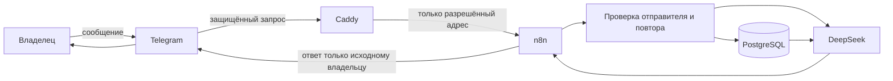

# Участники и потоки N8NAgents

Документ отражает последнее подтверждённое состояние рабочего сервера. OpenClaw будет добавлен в фактическую схему только после успешной проверки его установки.

## Участники

| Участник | За что отвечает | Чего ему делать нельзя |
|---|---|---|
| Владелец | Единственный разрешённый пользователь MVP | Передавать секреты в сообщения и давать доступ неизвестным получателям |
| Telegram Bot API | Получает и доставляет сообщения бота | Считаться доверенным источником до проверки отправителя |
| Caddy | Принимает защищённые соединения из интернета и пропускает только разрешённые адреса | Публиковать редактор n8n и внутренние служебные адреса |
| n8n | Выполняет строгие сценарии, проверяет правила, защищает операции от повторов и ведёт журнал | Давать модели произвольный доступ к SQL, сети, файлам или командной строке |
| DeepSeek | Понимает текст и формирует ответ | Выбирать получателя, учётные данные, адрес запроса или права доступа |
| PostgreSQL | Хранит состояние приложения, задачи, историю и служебные данные | Принимать соединения напрямую из интернета |
| Оператор | Развёртывает изменения и проверяет работу системы | Выводить секреты или выполнять необратимые действия без отдельного разрешения |
| Obsidian | Хранит понятную человеку и агентам документацию | Хранить токены, пароли и расшифрованные учётные данные |

## Подтверждённый поток сообщений до внедрения OpenClaw

## Границы доверия

1. Внешнее сообщение считается недоверенным, пока система не проверила секрет входящего запроса и отправителя.
2. Личность пользователя, адрес ответа и ключ истории формируются программой, а не языковой моделью.
3. DeepSeek получает только ограниченный контекст после проверки пользователя.
4. PostgreSQL и редактор n8n не публикуются в интернет.
5. Успешные выполнения не сохраняют полное содержимое сообщений в технических журналах.

## Правило обновления

Менять эту схему можно только после успешной проверки нового состояния на рабочем сервере. Планируемые связи описываются отдельно и не выдаются за действующие.

Связанные документы: [[Runtime_Flows_N8NAgents]], [[Change_History_N8NAgents]], [[Архитектура_AS_IS_и_API_Tools_N8NAgents]].
