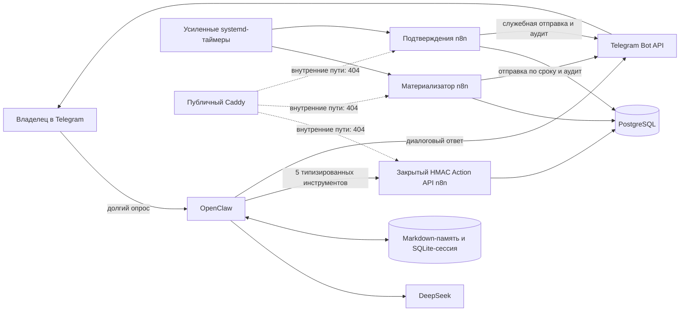

# Участники и потоки N8NAgents

Это фактическая схема рабочего сервера после проверки 31 августа 2026 года.

## Участники

| Участник | Ответственность | Ограничение |
|---|---|---|
| Владелец | Единственный разрешённый пользователь MVP | Не передаёт секреты и не добавляет новых получателей без отдельного решения |
| Telegram Bot API | Доставляет входящие и исходящие сообщения | Не является доверенной стороной до проверки пользователя и чата |
| OpenClaw | Единственный вход Telegram, диалог, память и выбор одного из пяти инструментов плагина `n8nagents-actions` `0.1.3` | Не имеет общего доступа к SQL, Docker, командной строке, браузеру, файлам или произвольным адресам HTTP |
| DeepSeek | Формирует ответ по ограниченному контексту | Не определяет права, получателя и параметры доступа |
| n8n Action API | Принимает подписанные структурированные команды OpenClaw | Не доступен через публичный Caddy |
| n8n | Проверяет правила, подпись, повторы и выполняет операции с напоминаниями | Не принимает Telegram как второй вход и не передаёт модели контроль над правилами |
| Системные таймеры | Периодически вызывают два внутренних сценария планировщика | Не публикуются в интернет и не обходят проверку HMAC-подписи |
| PostgreSQL | Главный источник истины для задач, напоминаний, подтверждений и аудита | Не доступен из интернета и напрямую из OpenClaw |
| Caddy | Закрывает публичный периметр | Для внутренних Action API и планировщиков возвращает `404` |
| Obsidian | Единственный канон понятной человеку и агентам документации | Не хранит токены, пароли, идентификаторы чата и содержимое сообщений |

## Фактический поток

Пять доступных OpenClaw инструментов: `reminder_create`, `reminder_list`, `reminder_cancel`, `reminder_reschedule`, `reminder_confirm`.

## Границы доверия

1. Только OpenClaw получает обновления Telegram; прежний основной сценарий n8n неактивен.
2. OpenClaw проверяет разрешённый личный чат и передаёт n8n только типизированную команду.
3. n8n независимо проверяет HMAC-подпись, структуру, права и ключ идемпотентности.
4. DeepSeek не получает секреты и не выбирает адрес, получателя или полномочия.
5. Системные таймеры обращаются к отдельным внутренним HMAC-webhook; старые планировщики неактивны.
6. PostgreSQL, n8n и служебные интерфейсы не публикуются в интернет.

Реальный пользовательский поток с кнопкой подтверждения проверен полностью: одно предложение → одно применение → одна задача → одно событие → одна доставка. Повторных строк и повторных Telegram-отправок нет.

## Правило обновления

Эта схема меняется только после проверки нового состояния на рабочем сервере. Планируемые связи описываются отдельно и не выдаются за действующие.

Связанные документы: [[Runtime_Flows_N8NAgents]], [[Change_History_N8NAgents]], [[Архитектура_AS_IS_и_API_Tools_N8NAgents]], [[Доказательство_OpenClaw_n8n_Production_PASS_20260831]].
