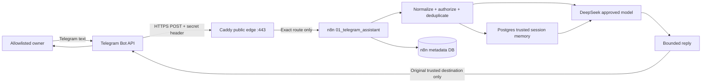

# Participants and Flows — N8NAgents AS-IS

Схема отражает только production state, прошедший проверку 2026-08-29. Планируемые tools/reminders не показаны как активные.

## Участники и доверие

| Участник | Роль | Доверенные данные | Запрещено делегировать модели |
|---|---|---|---|
| Владелец | Единственный разрешенный пользователь MVP | Allowlisted identity и исходный reply destination, хранящиеся только в runtime | Выбор нового recipient, credentials, admin actions |
| Telegram Bot API | Доставка update и outbound | Update проходит server-side secret header и numeric allowlist | Считать payload доверенным до gate |
| Caddy | Public TLS edge | Exact IP certificate, exact POST path, source/body/header gates | Editor exposure, произвольные routes, upstream admin |
| n8n main workflow | Детерминированная orchestration | Normalized trusted context и session key | Arbitrary SQL/HTTP/shell/filesystem/workflow selection |
| DeepSeek | Формирование ответа | Только bounded prompt/context после authorization | Recipient, credential, URL, SQL, admin или trusted identity |
| PostgreSQL | Metadata и memory persistence | Разделенные roles/schemas; memory runtime `CREATE` только в `memory` | Public host access, broad DDL, superuser |
| Production operator | Rollout, health, containment | Redacted facts и exact artifacts/hashes | Secret output, destructive cleanup без approval |
| Knowledge owner | Git/Obsidian reconciliation | Только verified AS-IS и redacted evidence | Повышать plan до production fact без PASS |

## Поток данных

## Контрольные границы

1. До Caddy все внешние данные недоверенные.
2. Missing/wrong secret, неверный method/path и неразрешенный source должны завершиться до n8n execution.
3. Identity, session key и reply destination формируются детерминированно до LLM.
4. LLM не выбирает recipient, credential, workflow ID, URL, SQL или admin action.
5. PostgreSQL не публикует host-port; n8n публикуется только loopback.
6. Success payload persistence отключена; evidence использует bounded counts и state transitions, не message content.

## Правило поддержки

Обновлять эту AS-IS схему только после `production verification PASS`. Любой future-state держать в отдельной заметке. Последовательность: `change → tests → rollout → prod PASS → схема → link/secret checks → Obsidian acceptance`.

## Связанные заметки

- [[CURRENT_STATE_N8NAgents_2026-08-29]]
- [[Runtime_Flows_N8NAgents]]
- [[Change_History_N8NAgents]]
- [[Агент_Production_Handoff_N8NAgents]]
