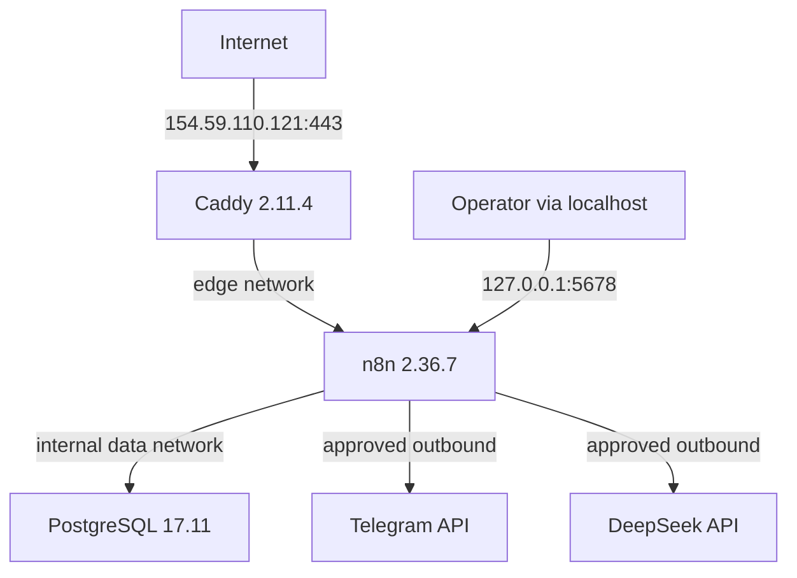
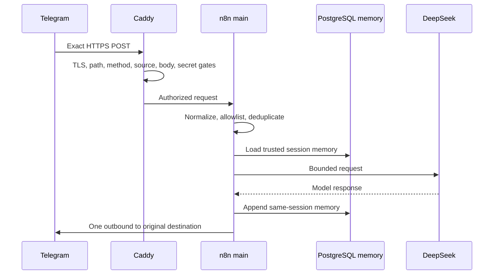

# Runtime Flows — N8NAgents AS-IS

## Production topology

Публичный `5678`, PostgreSQL host-port и Docker API отсутствуют. Caddy обслуживает IP certificate как default и для клиентов без SNI.

## Один Telegram update

Acceptance invariant: один update приводит к одному completed execution и одному outbound. A/B доказала рост memory `0→2→4` в одной сессии без раскрытия message content.

## Failure containment

```mermaid
flowchart LR
    Detect[Retry/error/exposure detected] --> StopIngress[Deactivate main/webhook or stop only Caddy]
    StopIngress --> Preserve[Preserve PostgreSQL, volumes, releases and evidence]
    Preserve --> Diagnose[Redacted health/count/root-cause checks]
    Diagnose --> Fix[Reviewed minimal fix]
    Fix --> Test[Negative + bounded positive tests]
    Test --> Rollout[Guarded rollout with rollback]
    Rollout --> Accept[Fresh production PASS]
    Accept --> Docs[Update AS-IS diagrams and KB]
```

Не использовать `down -v`, не удалять execution/data для маскировки ошибки и не продолжать live traffic при fan-out.

## Release/runtime reconciliation flow

1. Deployed immutable S2 release: `36e149374802263d644cc98e510f6113e1095dae`.
2. Effective Caddy runtime override: no ACME contact + default SNI; exact hashes в [[CURRENT_STATE_N8NAgents_2026-08-29]].
3. Production memory/grant corrections прошли A/B acceptance.
4. Source reconciliation существует в local Git commit `aa087b59f0c8b44ee6ebe93ccbd9f996eca49ce9`, но это еще не новый deployed release.
5. Следующий release обязан устранить drift через обычную цепочку tests/review/rollout/acceptance.

## Правило поддержки

Runtime diagram обновляется только по fresh production evidence. Planned topology и migrations описывать отдельно, не смешивая с AS-IS.

## Связанные заметки

- [[Participants_and_Flows_N8NAgents]]
- [[CURRENT_STATE_N8NAgents_2026-08-29]]
- [[Change_History_N8NAgents]]
- [[Доказательство_Production_Acceptance_N8NAgents_20260829]]
