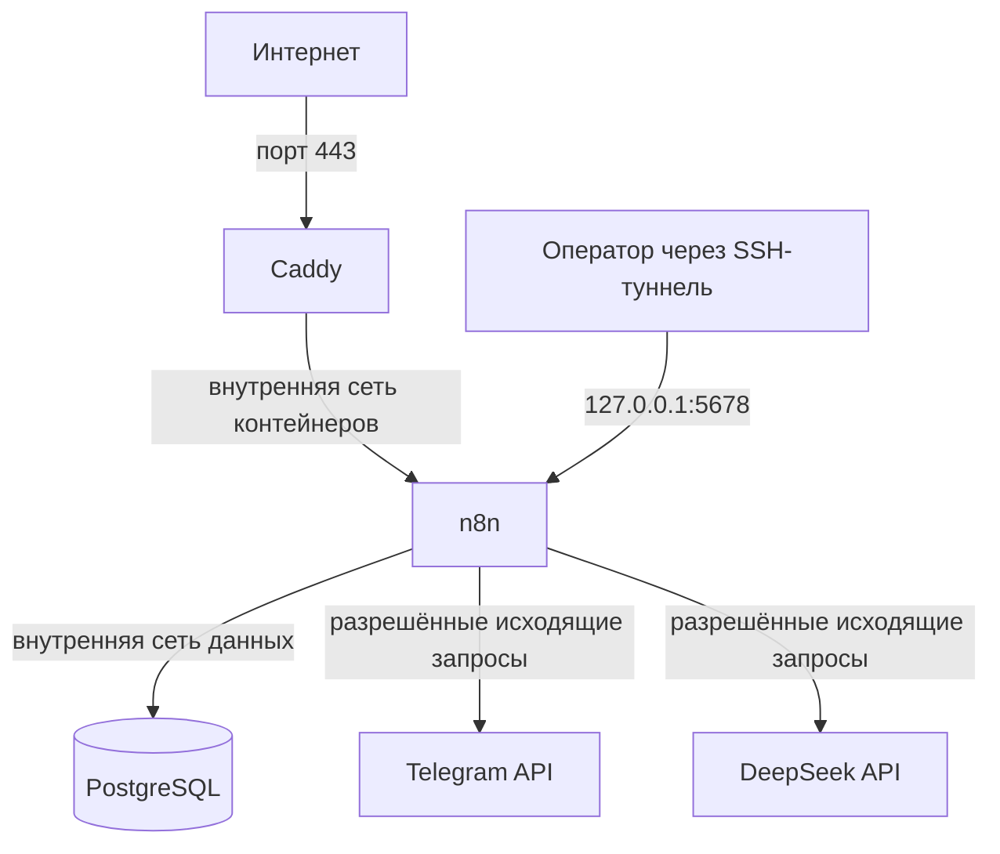
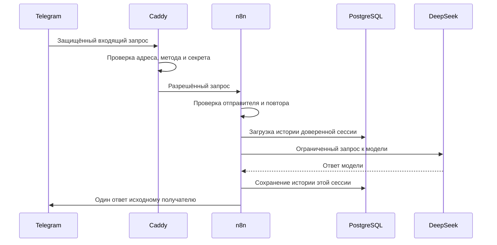

# Потоки выполнения N8NAgents

## Подтверждённая схема рабочего сервера

Порт n8n `5678`, PostgreSQL и программный интерфейс Docker не доступны из интернета. Административный доступ к n8n выполняется только через защищённый SSH-туннель.

## Обработка одного сообщения Telegram

Подтверждённое правило: одно входящее сообщение создаёт одно завершённое выполнение и не более одного исходящего ответа.

## Действия при ошибке

```mermaid
flowchart LR
    A[Обнаружена ошибка] --> B[Остановить только проблемный вход]
    B --> C[Сохранить базу, тома и предыдущую версию]
    C --> D[Найти причину без раскрытия секретов]
    D --> E[Внести минимальное исправление]
    E --> F[Проверить ошибочный и обычный случаи]
    F --> G[Развернуть с возможностью отката]
    G --> H[Повторно проверить рабочий сервер]
    H --> K[Обновить документацию]
```

Запрещено удалять тома или данные для сокрытия ошибки. При размножении ответов входящий поток останавливается до выяснения причины.

## Правило обновления

Схема меняется только по свежим доказательствам с рабочего сервера. Планируемая архитектура хранится отдельно.

Связанные документы: [[Participants_and_Flows_N8NAgents]], [[Change_History_N8NAgents]], [[Доказательство_Production_Acceptance_N8NAgents_20260829]].
