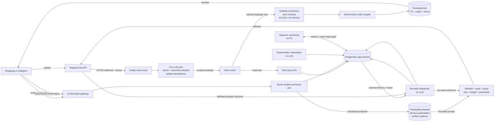
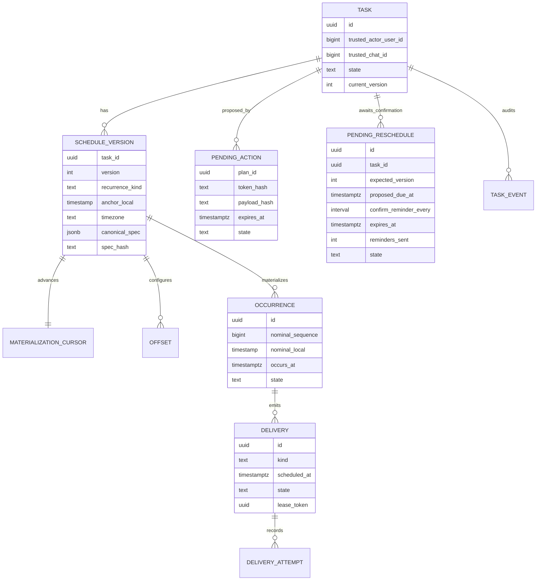

# TARGET / PLANNED — задачи и напоминания N8NAgents

> [!danger] Статус документа
> Дизайн **DESIGN_APPROVED**, но реализация остаётся **TARGET / PLANNED / NOT_DEPLOYED**. Документ не описывает текущую production-функцию и не является доказательством rollout. Канонический AS-IS остаётся в [[CURRENT_STATE_N8NAgents_2026-08-29]] и [[Архитектура_AS_IS_и_API_Tools_N8NAgents]]. Перенос этой схемы в AS-IS допустим только после `tests → rollout → production verification PASS`.

## 1. Решения владельца и цель

Зафиксированные входные решения:

1. Архитектура должна предусматривать **все перечисленные варианты** расписаний и операций, даже если часть policy modes не включается в первом rollout.
2. Единственная timezone первого релиза — `Europe/Moscow`.
3. Единственный recipient первого релиза — текущий allowlisted Telegram chat; его идентификатор не хранится в документации и не выбирается моделью.
4. Тихие часы первого релиза — `00:00–06:00 Europe/Moscow`; уведомления откладываются до 06:00 и объединяются в bounded digest.
5. При запросе переноса срока пользователь может указать, как часто напоминать о необходимости подтвердить перенос. До точного подтверждения новый срок не действует, а прежний срок остаётся authoritative.

Цель: пользователь ставит задачу естественным языком в Telegram, получает детерминированное предложение, подтверждает mutation, а система надёжно сохраняет задачу, материализует будущие occurrence и отправляет bounded reminders. Пользователь может просматривать, изменять, приостанавливать, возобновлять, откладывать, завершать и отменять задачи и серии.

## 2. Scope, границы и non-goals

### Входит в TARGET

- одноразовые и повторяющиеся задачи;
- несколько предварительных напоминаний и обязательное уведомление в момент due;
- pause/resume/edit/cancel/snooze/complete/list/show-missed/catch-up;
- quiet hours и digest;
- repeat-until-done;
- pending reschedule: server-sealed предложение нового срока и bounded cadence напоминаний до exact confirmation;
- durable PostgreSQL state, idempotency, leases, fencing и audit;
- strict model-facing parser и server-sealed mutation/delivery paths;
- bounded catch-up после простоя;
- migration legacy `app.reminders` и обратимый rollout;
- контролируемый Telegram canary только в текущий allowlisted chat.

### Не входит

- arbitrary cron/RRULE, SQL, URL, workflow ID, credential ID или generic HTTP tool из model output;
- новые recipients, группы, broadcast, forwarding и cross-chat task sharing;
- hard real-time/emergency alarm SLA;
- глобальная гарантия exactly-once delivery в Telegram;
- автоматическое определение выполнения по свободной беседе;
- LLM в dispatcher, retry, catch-up, authorization или scheduler;
- callback buttons/media/channel updates до отдельного расширения Telegram contract;
- внешние calendars, payments и публикации;
- backup/replication redesign, destructive cleanup, secrets management;
- изменение AS-IS до production verification `PASS`.

## 3. AS-IS gap

Сейчас production имеет импортированные inactive workflows `tool_create_reminder`, `tool_list_reminders` и `reminder_dispatcher`, а PostgreSQL — legacy `app.reminders`. Однако:

- active `01_telegram_assistant` не имеет `ai_tool` edges;
- reminder workflows не reachable из selected Native AI Agent path;
- dispatcher inactive;
- legacy модель ориентирована на одно `due_at` и не покрывает versioned recurrence, occurrences, multiple deliveries, snooze, quiet hours и безопасный catch-up;
- production acceptance напоминаний отсутствует.

Следовательно, текущий AS-IS **не предоставляет пользователю функцию постановки задач и напоминаний**.

## 4. Участники, trust boundaries и потоки



### Trust rules

- `trusted_actor_user_id` и `trusted_chat_id` берутся только из нормализованного Telegram webhook после проверки secret/allowlist.
- Model-facing schema не содержит recipient, actor/chat IDs, database IDs, handles, tokens, SQL, URL, cron, workflow или credential references.
- Mutation получает trusted envelope только от deterministic parent workflow.
- Перед каждой отправкой выполняется **live** allowlist/policy check; revoked recipient блокирует send.
- Любой сбой auth, allowlist, policy, budget, timezone engine, idempotency, confirmation store или credential binding приводит к fail-closed.

## 5. Доменная модель



### 5.1 Task

Стабильная identity пользовательского поручения. Состояния:

```text
active ─pause→ paused ─resume→ active
active/paused ─complete_series→ completed (terminal)
active/paused ─cancel_series→ cancelled (terminal)
```

Поля: server UUID, trusted actor/chat, state, `current_version`, timestamps, create correlation. Recipient неизменяем и не поступает от LLM.

### 5.2 ScheduleVersion

Immutable snapshot текста, расписания и policy. Любые edit/pause/resume/cancel/series-complete создают новую version или атомарно увеличивают `current_version`; старые claims теряют eligibility. Нормализованные поля — исполняемый источник истины, canonical JSONB — audit/API snapshot.

### 5.3 Occurrence

Конкретный nominal экземпляр серии. Уникальность: `(task_id, task_version, nominal_sequence)`. Состояния: `materialized`, `open`, `completed`, `missed`, `superseded`, `cancelled`. Хранится исходное Moscow civil time и вычисленный UTC instant.

### 5.4 Delivery и DeliveryAttempt

Delivery — очередь уведомлений occurrence: `due`, `offset`, `snooze`, `repeat`, `catch_up`, `digest`. Attempt — append-only запись одной попытки Telegram send без message content/headers/tokens.

### 5.5 PendingAction

Server-sealed предложение mutation: actor/chat scope, canonical payload hash, revision, one-use token hash, TTL, состояние `pending/applied/expired/rejected/conflict`. Модель не может создать или подписать его сама.

### 5.6 PendingReschedule

Отдельное server-sealed ожидание подтверждения переноса срока. Оно содержит task/occurrence scope, `expected_version`, hash предлагаемого нового срока, `confirm_reminder_every`, следующий момент напоминания, expiry и счётчик отправок; recipient наследуется из trusted task scope.

- **DEFAULT cadence:** 30 минут; пользователь выбирает от 5 минут до 24 часов.
- Initial TTL — 24 часа; по явному выбору пользователя допускается продление, но hard max — 7 дней и 50 confirmation reminders.
- Новый срок не становится schedule truth до exact bound confirmation. Старый due/schedule остаётся authoritative и выполняется штатно, включая случай, когда старый due наступил во время ожидания.
- Confirmation атомарно проверяет actor/chat, task/occurrence, expected version, proposal hash, token, expiry и переводит `pending → applied`; затем cadence прекращается в той же transaction.
- `cancel`, `supersede`, expiry, task/occurrence completion и успешное confirmation атомарно прекращают cadence и делают старый token непригодным.
- Одновременно разрешён только один active pending reschedule на одну task/occurrence; новый proposal supersedes предыдущий после explicit preview.

## 6. Полный schedule DSL

Arbitrary cron/RRULE запрещён. `schedule.kind` — закрытый enum:

| Kind | Смысл | Обязательные поля |
|---|---|---|
| `once` | Один раз | `local_datetime` |
| `interval` | Через равные elapsed intervals | `anchor_local`, `every`, `unit` |
| `daily` | Каждый день в Moscow civil time | `local_time` |
| `weekdays` | Пн–Пт | `local_time` |
| `weekly` | Выбранные ISO weekdays | `weekdays[]`, `local_time` |
| `monthly_date` | Число месяца | `month_day`, `local_time`, `invalid_date_policy` |
| `monthly_nth_weekday` | N-й weekday месяца | `ordinal 1..5`, `weekday`, `local_time`, `invalid_date_policy` |
| `monthly_last_day` | Последний календарный день | `local_time` |
| `monthly_last_weekday` | Последний выбранный weekday | `weekday`, `local_time` |
| `yearly` | Месяц/число ежегодно | `month`, `month_day`, `local_time`, `invalid_date_policy` |

### 6.1 End conditions

Ровно один режим:

- `forever`;
- `until_date` — включительно по local date;
- `count` — число nominal occurrences, максимум policy cap.

### 6.2 Invalid calendar date

- **DEFAULT:** `skip` для 29/30/31, отсутствующей пятой недели и 29 февраля.
- Configurable mode: `last_day` переносит только calendar-invalid occurrence на последний день месяца.
- Policy фиксируется в version и отображается в preview; silent guessing запрещён.

### 6.3 Offsets и due notification

- due delivery с offset `0` обязателен;
- **MVP DEFAULT:** до 5 уникальных pre-reminders, только отрицательные offsets;
- positive follow-up offsets предусмотрены DSL как disabled policy mode и требуют отдельного approval перед включением;
- полный batch создаётся атомарно или отклоняется целиком.

### 6.4 Snooze

- **DEFAULT:** переносит только текущую occurrence, не всю series;
- диапазон 1 минута–30 дней, не более 20 snooze на occurrence;
- snooze отменяет только ещё не отправленные eligible deliveries этой occurrence и создаёт новую immutable delivery generation;
- режим `snooze_series` архитектурно возможен, но не включён: это explicit edit будущего schedule с новым preview/confirmation.

### 6.5 Repeat-until-done

- **DEFAULT:** один open occurrence; после уведомления создаётся bounded repeat delivery, пока occurrence не `completed`;
- минимум 15 минут, максимум 8 повторов и 24 часа без acknowledgement;
- ночью цепочка не накапливается: максимум один deferred repeat в утреннем digest;
- новые nominal occurrences во время open chain coalesce/miss по policy; после completion cadence продолжается с первой будущей nominal occurrence;
- configurable alternative `independent_occurrences` заложена, но disabled из-за риска параллельных бесконечных цепочек.

### 6.6 Missed/catch-up

Safe defaults:

| Случай | DEFAULT |
|---|---|
| One-shot опоздал <24h | Один late delivery |
| Recurring опоздал <6h | Только latest missed occurrence |
| Recurring старше 6h | `skipped_by_catchup_policy` |
| Repeat-until-done | Один catch-up repeat, затем обычный cadence |
| Несколько offsets/task | Один bounded digest |

Configurable modes сохраняются: `skip`, `latest_only`, `all_limited`. `all_limited` всегда имеет `max_count`, `max_age`, daily/outbound cap и manual gate выше storm threshold.

Dispatcher остаётся paused до dry-run/manual decision, если: due >20 всего, сообщений одному chat >5, oldest due >24h или будет превышен outbound/cost cap.

### 6.7 Quiet hours

- **APPROVED DEFAULT:** `00:00–06:00 Europe/Moscow`;
- действие: defer до 06:00 и объединить в bounded plain-text digest;
- per-task overnight override возможен только после отдельного explicit preview/confirmation;
- режимы `drop`, `deliver_immediately`, custom interval заложены как configurable policy, но disabled в MVP;
- quiet hours не превращают систему в emergency alarm.

### 6.8 Подтверждаемый перенос срока

Перенос — двухфазная mutation, а не немедленная запись нового срока:

1. Пользователь задаёт новый срок и может сказать cadence: «перенеси на пятницу и напоминай подтвердить каждые 20 минут».
2. Parser возвращает proposal с `proposed_schedule` и `confirm_reminder_every`; если cadence отсутствует, compiler применяет 30 минут.
3. Бот показывает старый authoritative срок, предлагаемый срок, cadence, expiry и exact confirmation token.
4. Пока exact confirmation не получено, новый срок имеет статус `pending`; deterministic dispatcher напоминает подтвердить не чаще выбранного cadence с учётом quiet hours/rate caps.
5. Если прежний срок наступает до confirmation, его due/repeat/catch-up поведение не меняется.
6. Exact confirmation атомарно активирует новую ScheduleVersion и останавливает cadence. Cancel, supersede, expiry или completion только останавливают cadence; неподтверждённый срок никогда не становится active молча.

Диапазон `confirm_reminder_every`: 5 минут–24 часа; default 30 минут. Initial TTL 24 часа, hard max 7 дней и 50 reminders. Quiet-hours defer не порождает backlog: к 06:00 допускается один bounded reminder/digest, затем cadence продолжается от фактической отправки.

## 7. Intents и UX

### 7.1 Intent catalogue

- `TASK_CREATE`, `TASK_EDIT`, `TASK_LIST`, `TASK_COMPLETE`, `TASK_CANCEL`;
- `REMINDER_CREATE`, `REMINDER_EDIT`, `REMINDER_LIST`;
- `PAUSE`, `RESUME`, `SNOOZE`, `COMPLETE_OCCURRENCE`, `COMPLETE_SERIES`, `CANCEL_OCCURRENCE`, `CANCEL_SERIES`;
- `SHOW_MISSED`, `CATCH_UP`, `SHOW_DETAILS`;
- `RESCHEDULE_PROPOSE`, `RESCHEDULE_CONFIRM`, `RESCHEDULE_CANCEL`;
- `CLARIFY`, `HELP`, `DRAFT_DISCARD`, `CONFIRM`.

Read-only list/show не требует confirmation. Любая model-derived mutation требует confirmation.

### 7.2 Базовый диалог mutation

1. Пользователь: «Напоминай платить аренду первого числа в 10:00».
2. Auth извлекает trusted actor/chat, LLM получает только natural-language text.
3. Parser возвращает strict structured proposal.
4. Server compiler нормализует `Europe/Moscow`, применяет defaults и создаёт `PendingAction`.
5. Telegram preview: текст, расписание, окончание, pre-reminders, quiet/catch-up/repeat policies и последствия.
6. Пользователь отправляет exact `ПОДТВЕРЖДАЮ R-<token>`.
7. Confirmation gateway сверяет actor/chat/hash/revision/TTL/one-use и вызывает sealed mutation.
8. Повтор того же confirmation возвращает сохранённый результат, а не создаёт duplicate.

### 7.3 Clarification

Если отсутствует дата/время, неоднозначны «потом», «в пятницу», объект edit или scope completion, система задаёт один узкий вопрос и не создаёт side effect. Для двух подходящих задач показываются bounded handles, но database UUID не передаются модели.

### 7.4 Completion semantics

- «готово» с exact occurrence handle/reply — завершает **текущую occurrence**;
- recurring series продолжает жить;
- «заверши задачу полностью/навсегда» — отдельный `COMPLETE_SERIES` с подтверждением;
- edit по умолчанию действует только на future occurrences; history immutable.

Deterministic exact-handle `done/cancel/snooze` fast-path можно включить позже без LLM, но model-derived и bulk операции остаются подтверждаемыми.

### 7.5 UX переноса

Пример:

1. Пользователь: «Перенеси отчёт на завтра 12:00 и напоминай подтвердить каждые 15 минут».
2. Бот: «Сейчас действует: сегодня 18:00. Предлагается: завтра 12:00. Пока перенос не подтверждён, старый срок действует. Напоминать подтвердить каждые 15 минут, не позже 24 часов. Для применения: `ПОДТВЕРЖДАЮ R-<token>`».
3. До confirmation приходят bounded prompts с тем же public handle/token; в `00:00–06:00` они откладываются и coalesce.
4. После exact confirmation: «Перенос подтверждён: завтра 12:00. Напоминания подтвердить остановлены».

Если пользователь говорит только «перенеси», бот обязан уточнить новый срок. Если новый срок назван, но cadence нет, preview явно показывает default 30 минут. Команды «не переноси»/«отмени перенос» отменяют только pending proposal и не меняют старый authoritative schedule.

## 8. Contracts

### 8.1 Model-facing `reminders.parse@2`

Strict JSON Schema, `additionalProperties: false`. Разрешено:

```text
schema_version, intent, title, description,
schedule(kind + typed fields), end_condition,
pre_reminders, quiet_policy_request,
missed_policy_request, repeat_until_done,
snooze_duration, proposed_schedule,
confirm_reminder_every, reschedule_ttl,
target_hint, clarification
```

Запрещено: `chat_id`, `user_id`, recipient, timezone override, DB UUID, token, nonce, idempotency key, cron/RRULE, SQL, URL, credential/workflow/node ID, HTTP method/headers. Один schema-repair допустим; затем fail-closed static error. Parser не имеет tools и общей conversation memory.

### 8.2 Server-sealed `reminders.draft@2`

Получает trusted envelope отдельно от parser result. Валидирует typed DSL, quotas и calendar semantics; canonicalizes payload; вычисляет summary/hash; создаёт `plan_id` и one-use confirmation token. Возвращает только public handle, preview и expiry.

### 8.3 Server-sealed `reminders.apply@2`

Вызывается только confirmation gateway. Требует trusted actor/chat, plan ID, token hash match, payload hash, expected revision и server-generated idempotency key. Выполняет одну atomic command procedure. Unknown mutation outcome возвращает `MUTATION_OUTCOME_UNCERTAIN`; blind replay запрещён до DB lookup.

Для `RESCHEDULE_CONFIRM` дополнительно fences на current task/occurrence version и active pending-reschedule ID. В одной transaction создаёт новую ScheduleVersion, supersedes будущие old-version deliveries, переводит proposal в `applied` и исключает следующие confirmation reminders. Для stale/expired/superseded proposal возвращает stable conflict без изменения старого schedule.

### 8.4 Read contracts

Actor/chat-scoped list/get возвращают bounded projection, Moscow times, public handles и pagination; raw internal IDs, secrets и чужие records недоступны. Max page size 50.

## 9. Confirmation, replay и idempotency

- token format: `R-<opaque random>`; entropy не менее 128 bit; хранится только hash;
- exact confirmation: `ПОДТВЕРЖДАЮ R-<token>`;
- TTL 15 минут; максимум 3 pending drafts на chat;
- binding: actor + chat + plan + canonical payload hash + object revision;
- one-use; reused token возвращает прежний result;
- неверные попытки: максимум 5 за 10 минут;
- stale webhook старше policy window не создаёт side effect без reconfirmation;
- inbound uniqueness: `(bot_id, update_id)`;
- mutation uniqueness: `(update_id, action_index, operation)` + canonical payload hash;
- same key/same hash → cached result; same key/different hash → hard conflict;
- recurrence materialization uniqueness: `(schedule_version_id, nominal_sequence)`;
- delivery uniqueness: `(occurrence_id, delivery_kind, ordinal/generation)`.

## 10. PostgreSQL design и runtime functions

### 10.1 Tables

- `app.reminder_tasks`;
- `app.reminder_task_versions`;
- `app.reminder_materialization_cursors`;
- `app.reminder_offsets`;
- `app.reminder_occurrences`;
- `app.reminder_deliveries`;
- `app.reminder_delivery_attempts`;
- `app.reminder_task_events`;
- `app.reminder_pending_actions`;
- `app.reminder_pending_reschedules`.

Runtime roles не получают direct table DML. Все transitions — narrow `SECURITY DEFINER` functions с fixed `search_path=pg_catalog,app`, ownership checks, typed inputs и sanitized outputs.

### 10.2 Required functions

- draft: create/get/expire/reject pending action;
- commands: create/edit/pause/resume/cancel/complete/snooze;
- reschedule: propose, claim-confirm-prompt, exact confirm, cancel/supersede/expire pending proposal;
- reads: scoped list/get/missed;
- scheduler: materialize bounded batch, advance cursor;
- dispatcher: claim, `pre_send_authorize`, finalize sent/retry/uncertain/dead-letter;
- maintenance: release definite pre-call expired claim, prune/archive terminal records;
- exact operator repair: resolve one uncertain/dead-letter item; никаких wildcard/bulk generic operations.

### 10.3 Materializer

- DB `now()` — clock source;
- calendar rules вычисляются в `Europe/Moscow`, queue timestamps — UTC `timestamptz`;
- rolling horizon default 30 дней, hard max 90; max 100 tasks/batch и 500 occurrences/task/run;
- `FOR UPDATE SKIP LOCKED`;
- cursor и inserts в одной transaction;
- crash до commit повторяется idempotently, после commit cursor уже сохранён;
- horizon alert critical при <7 дней.

### 10.4 Claim, lease и fencing

Delivery states:

```text
pending/retry_wait ─claim→ claimed
claimed ─known success→ sent
claimed ─known pre-acceptance retryable failure→ retry_wait
claimed ─permanent failure→ failed/dead_letter
claimed ─ambiguous external result→ uncertain
pending/retry_wait/claimed ─new task version→ superseded/cancelled
```

Claim проверяет task active, `delivery.task_version = task.current_version`, due time и occurrence eligibility. Lease имеет owner/token/expiry; каждый finalizer fences на token и current version.

### 10.5 Cancel/edit race

Cancel/edit locks task и увеличивает generation/version. `pre_send_authorize` выполняется непосредственно перед network call и повторно проверяет version, state, allowlist, quiet/quota/budget. Если cancel commit произошёл раньше authorize — send запрещён. Если запрос уже authorized/in-flight, честный ответ: `message may already arrive`; ложное «полностью отменено» запрещено.

## 11. Telegram delivery uncertainty

Telegram `sendMessage` не даёт caller idempotency key, поэтому exactly-once user-visible delivery недоказуема.

| Outcome | Transition |
|---|---|
| Valid 200 + message_id | `sent` |
| Definite DNS/connect failure before request | bounded automatic retry |
| 429 before acceptance | `retry_wait` по Retry-After |
| Definite 400/403 | `dead_letter` / recipient disabled |
| Timeout/lost response after possible send, unclear 5xx | `uncertain`; **no blind retry** |
| Crash before network call | safe retry after proof |
| Crash after possible provider acceptance | `uncertain` |

Manual resolution одного exact item: `mark_received`, `cancel_without_retry`, либо `retry_possible_duplicate` с explicit warning/confirmation. Configurable duplicate-preferring mode предусмотрен, но disabled по умолчанию.

## 12. Quotas, rate, cost и spam protection

Стартовые configurable caps:

| Gate | Safe default |
|---|---|
| Active tasks/chat | 100 |
| Recurring/forever tasks/chat | 50 |
| Pre-reminders/occurrence | 5 + mandatory due |
| Normal recurrence minimum | 15 минут |
| Absolute reviewed floor | 5 минут, только policy override |
| Count end | 500 nominal occurrences |
| Mutations | 20/hour, 100/day |
| Inbound | burst 10/min, 60/hour, 300/day |
| Outbound | 3/5min, 20/hour, 50/day/chat |
| Repeat-until-done | 15min minimum, 8 repeats, 24h |
| Reschedule confirmation cadence | default 30min; 5min–24h |
| Pending reschedule lifetime | initial 24h; hard max 7d / 50 prompts |
| Batch create | 10 tasks, atomic + preview |
| List page | 50 |

Dispatcher/catch-up/retry/completion не вызывают DeepSeek. Parser имеет отдельные request/token/currency hard caps. Недоступность durable counter блокирует parse/mutation/send, а не разрешает их.

## 13. Retention, PII, audit и monitoring

### 13.1 Retention proposal

- raw Telegram webhook body — не сохранять;
- DeepSeek prompt/raw response и Telegram/provider body — не сохранять;
- pending proposals — до 24 часов;
- idempotency results без task text — 30 дней;
- replay tombstone `(bot_id, update_id, outcome)` — 180 дней;
- active task content — пока active; terminal content — 30 дней;
- terminal occurrences/deliveries — 90 дней online;
- attempts — 180 дней;
- uncertain/dead-letter — до resolution +30 дней, hard max 90 для content;
- sanitized task events/audit — 1 год;
- позднее partition lifecycle вместо runtime generic DELETE.

Retention — configurable policy и должна быть принята до production rollout. Audit содержит только correlation, scoped identifiers, operation/object, hashes, stable codes, timestamps и buckets; никаких bodies/prompts/headers/tokens.

### 13.2 Monitoring

- dispatcher heartbeat, due queue depth, oldest due age, p95 schedule-to-send;
- stuck leases, `uncertain > 0`, `dead_letter > 0`;
- Telegram 429/5xx/403, allowlist/policy denials;
- confirmation replay/stale conflicts;
- inbound/LLM/mutation/outbound quota at 80%;
- DeepSeek parse invalid/timeout/budget;
- materialization horizon, DB/storage/clock skew >5s;
- invariant `unauthorized_effects == 0`.

Alerts не содержат PII. Новый external alert recipient требует отдельного approval; failure handler имеет recursion guard.

## 14. Migration, rollout и rollback

1. Read-only baseline: source/runtime/workflow/DB grants and counts, redacted.
2. Ship new schema/functions disabled; legacy `app.reminders` и старые functions не удалять.
3. Backfill legacy rows в `once`, Moscow, due offset 0; `claimed` legacy → `uncertain`; terminal states preserve audit.
4. Inactive import новых workflows/contracts; exact graph audit: parser no tools/memory, dispatcher no LLM.
5. Shadow materializer создаёт/сверяет rows, но не отправляет.
6. Dry-run backlog + quotas/quiet/catch-up policy review.
7. Bind only existing Telegram/DeepSeek credential metadata without reading values; current allowlisted chat only.
8. Canary with agreed message cap and stop condition.
9. Production acceptance: create/list/edit/pause/resume/snooze/complete/cancel, recurrence, memory non-regression, fault/race tests.
10. Только после PASS включить v2 dispatcher/tool reachability и revoke legacy create path.
11. После fresh production PASS обновить четыре обязательных AS-IS artifacts и Change History.

Rollback: deactivate new tool/parser/dispatcher edges, stop v2 claims/materialization, preserve v2 tables/audit/idempotency, restore legacy reachability only if its compatibility gate passes. Rollback не удаляет rows, attempts, releases или evidence.

## 15. Acceptance, negative, concurrency и fault tests

### Auth/trust

- missing/wrong webhook secret/method/path/content type;
- unknown user и unknown chat;
- forged actor/chat и revoked allowlist between create/send;
- model output с recipient/ID/URL/SQL/cron/workflow/credential fields;
- cross-chat handle/IDOR;
- zero DB/LLM/effect before auth.

### Confirmation/contracts

- expired/wrong/reused token, other actor/chat, changed revision/hash;
- concurrent confirmations;
- same idempotency key with same/different hash;
- task text containing confirmation words does not execute;
- parser invalid/extra fields/schema repair exhaustion;
- duplicate Telegram update does not duplicate mutation.

### Scheduling

- all 10 schedule kinds;
- midnight/month/year boundaries, leap day, 29/30/31, fifth/last weekday;
- forever/until/count;
- offsets uniqueness and mandatory due;
- quiet boundaries 23:59/00:00/05:59/06:00;
- pending reschedule cadence 5min/default30min/24h, TTL 24h/7d and cap 50;
- old due remains authoritative before confirmation and fires normally if reached;
- confirm/cancel/supersede/expiry/completion atomically stop confirmation cadence;
- quiet-window coalescing creates at most one 06:00 prompt/digest and no backlog storm;
- repeat caps/acknowledgement;
- Moscow → UTC correctness and server timezone independence;
- rolling materialization uniqueness/restart.

### Lifecycle/races

- pause/resume/edit future-only;
- occurrence complete vs series complete;
- occurrence snooze vs disabled series snooze;
- two materializers and two dispatchers;
- lease expiry/reclaim;
- cancel/edit/done at barriers before claim, after claim, before authorize, during network, after success;
- old version claim/finalizer fenced.

### Telegram/faults

- 200/400/403/429, DNS/connect-before-write, timeout before/after possible write, malformed response;
- crash before send/during send/after provider success before DB finalize;
- uncertain proves no automatic retry;
- fail-closed when DB, allowlist, policy, budget, timezone or credentials unavailable.

### Downtime/storm

- 1/10/100/1000 missed occurrences;
- skip/latest-only/all-limited;
- one-shot <24h, recurring <6h, older skip;
- threshold pauses dispatcher and dry-run count matches;
- catch-up respects quiet/rate/day caps and does not starve current due.

### PII/least privilege

- no raw payload/prompt/tool args/provider body in execution/log/audit/alert;
- runtime roles cannot generic DML/DDL, recipient or audit mutation;
- no arbitrary HTTP/shell/filesystem/code nodes on the capability path;
- retention removes content but preserves minimum replay/audit evidence.

## 16. Traceability

| Requirement | Design control | Acceptance evidence required |
|---|---|---|
| Задачи сохраняются | Task + immutable ScheduleVersion in PostgreSQL | Restart/readback and DB constraint PASS |
| Все виды расписаний | Closed typed DSL | Boundary matrix for every kind/end/policy |
| Moscow | Exact timezone check + civil/UTC pair | TZ/server-independence tests |
| Один текущий chat | Trusted webhook envelope + live allowlist | Unknown/cross-chat/revocation negative tests |
| Напоминание вовремя | Materializer + due queue + dispatcher | schedule-to-send canary and queue metrics |
| Нет duplicate mutation | Update/mutation/confirmation idempotency | Replay/concurrent confirmation tests |
| Не спамить | quiet/digest/caps/repeat/catch-up gates | storm/fault tests |
| Перенос требует подтверждения | PendingReschedule + version/hash/token binding | Old due remains active; cadence and all terminal stop races PASS |
| Частоту напоминаний выбирает пользователь | Bounded `confirm_reminder_every` 5m..24h, default 30m | Boundary/default/quiet/TTL/cap tests |
| Безопасно менять | version/fencing/future-only edit | old claim and race tests |
| Честно об uncertain | explicit state, no blind retry | timeout/crash fault injection |
| Агент может управлять | parser → preview → sealed apply | exact graph + dialogue acceptance |
| AS-IS не искажён | separate TARGET note | KB governance audit before/after rollout |

## 17. Phases и gates

| Phase | Результат | Gate |
|---|---|---|
| D0 | Владелец принимает safe defaults и implementation scope | `DESIGN_APPROVED` — **PASS 2026-08-29** |
| D1 | Versioned JSON Schemas, SQL model, state tables, threat model | independent architecture/security review GO |
| L1 | Local migration/functions/unit/property/concurrency tests | all local gates PASS |
| L2 | Local n8n inactive import, exact graph, Telegram/DeepSeek mocks | no tools in parser, no LLM in dispatcher |
| P0 | Production read-only baseline and rollback package | no unexplained drift |
| P1 | Disabled schema/import + shadow materializer | zero external effects |
| P2 | Current-chat bounded canary | agreed cap; zero unauthorized effects |
| P3 | Full reminder acceptance + fault/race tests | production verification PASS |
| KB | Promote verified facts to AS-IS diagrams/history | links/frontmatter/secret checks PASS |

## 18. Утверждённые defaults — DESIGN_APPROVED

Следующие defaults приняты владельцем, но **не являются deployed facts** до production verification `PASS`:

1. Все model-derived mutations подтверждаются; exact-handle fast-path позже.
2. Quiet `00:00–06:00 Europe/Moscow`, defer+bounded digest; overnight only per-task confirmed override.
3. Uncertain Telegram outcome не повторяется автоматически.
4. Snooze occurrence-only; edit future-only.
5. «Готово» завершает occurrence; series completion — отдельная explicit команда.
6. Monthly invalid date `skip`; configurable `last_day`.
7. До 5 pre-reminders, due mandatory, positive offsets disabled initially.
8. Catch-up: one-shot <24h once; recurring latest-only <6h; storm thresholds manual.
9. Repeat-until-done: single open occurrence, 15min/8 repeats/24h.
10. Current allowlisted chat only; no arbitrary cron/RRULE; no LLM in background paths.
11. Caps и retention из разделов 12–13 configurable, изменение только reviewed policy rollout.
12. Перенос срока двухфазный: old due authoritative до exact bound confirmation; cadence пользовательский, default 30m, range 5m..24h, initial TTL 24h, hard max 7d/50; cadence атомарно останавливается при confirm/cancel/supersede/expiry/completion.

Статус решения: `DESIGN_APPROVED / NOT_DEPLOYED`. Дополнительных блокирующих продуктовых вопросов для начала реализации нет. Любое отклонение оформляется как явное policy decision до кода/rollout.

## Связанные заметки

- [[CURRENT_STATE_N8NAgents_2026-08-29]]
- [[Архитектура_AS_IS_и_API_Tools_N8NAgents]]
- [[MOC_N8NAgents]]
- [[Открытые_Задачи_N8NAgents_2026-08-29]]
- [[Промпт_Recovery_Handoff_N8NAgents_2026-08-29]]
