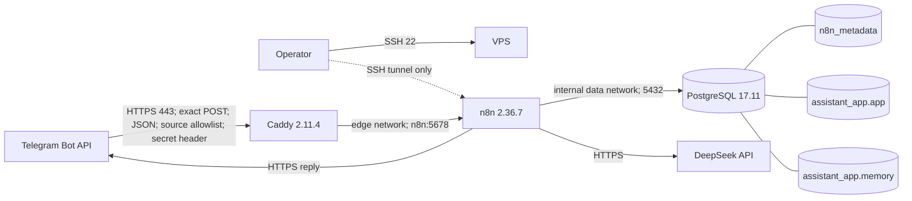
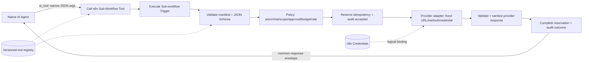
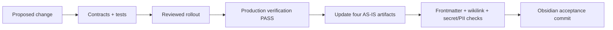

# N8NAgents — каноническая production AS-IS и архитектура API-tools

Последняя production verification: **2026-08-29, PASS**. Документ не содержит secret values, credential IDs, Telegram identifiers, public address или message bodies. Runtime-факты приведены redacted; repository-only и planned утверждения помечены отдельно.

Эта заметка в canonical Obsidian vault — единственный human/agent-readable канонический архитектурный документ. Путь в source repository ниже служит только provenance адаптации; локальный source hygiene successor `d163606a...` уже удалил tracked human-readable docs и оставил machine-consumed code/config/tests/contracts. Source repository не имеет `origin`, поэтому successor не upstream-published.

Источник адаптации: `N8NAgents/docs/as-is-and-api-tools.md`, исторический commit `a6869561338427b79bc27b0019a6ea48d13165ef`, финальный source GO `09824a6e16e479d2283ddbd4fb5125a50bda5113`, tree `5eb0df96c8ab908ba45cdd18c8286ce683528135`.

## Язык статусов

| Метка | Значение |
|---|---|
| **VERIFIED AS-IS** | Наблюдалось в production либо подтверждено завершенной production acceptance. |
| **REPOSITORY SPEC** | Присутствует в versioned schemas/specs, но само по себе не доказывает активность в production. |
| **TARGET / PLANNED** | Целевая архитектура; не текущая функция. |
| **UNKNOWN** | Не доказано приемлемым production evidence. |

AS-IS нельзя обновлять из намерения, draft export или успешного local test. Он меняется только после production verification `PASS`.

## Участники и trust boundaries — VERIFIED AS-IS

| Участник | Trust / ответственность | Текущее взаимодействие |
|---|---|---|
| Telegram user/chat | Вход недоверенный до deterministic authorization; reply destination никогда не выбирается моделью. | Отправляет один поддерживаемый text update и получает bounded plain-text chunks. |
| Telegram Bot API | Внешний provider. | Доставляет webhook с server-held secret header; принимает reply только для normalized original chat. |
| Caddy | Public trust boundary и TLS terminator. | Допускает exact route, source networks, JSON content type, secret header, method и body size. |
| n8n `01_telegram_assistant` | Единственный active application orchestrator. | Normalize/authorize, update claim, DeepSeek, PostgreSQL memory, outbound reservation, reply, completion/failure. |
| DeepSeek | Внешний LLM; output недоверенный. | Текущий production path использует native model с `deepseek-chat`. |
| PostgreSQL `n8n_metadata` | n8n-owned metadata boundary. | Workflows, encrypted credential records и n8n metadata. |
| PostgreSQL `assistant_app.app` | Deterministic application state/effects. | Update state, outbound budget/attempts, notes, reminders, idempotency, sanitized audit. |
| PostgreSQL `assistant_app.memory` | Chat-memory boundary. | LangChain messages, разделенные trusted session key. |
| Operator | Привилегированный человек. | Credential/allowlist/release binding, promotion, verification, containment, rollback, KB acceptance. |
| Custom API provider | **TARGET / PLANNED** external capability. | Получает только schema-valid и policy-approved request через named adapter. |

Логические credentials документируются только по назначению. Credential values, database IDs, tokens, headers, allowlist identifiers и session identifiers запрещены в KB.

## Runtime flows

### Component и network topology — VERIFIED AS-IS



| Service | Runtime tag/version observed | Networks | Host exposure | Runtime controls observed |
|---|---|---|---|---|
| `caddy` | `caddy:2.11.4-alpine` | `edge` | Public TCP 443; public 80 отсутствует | healthy; read-only rootfs; 160 MiB; 0.5 CPU; 100 PIDs; `unless-stopped`; capabilities dropped кроме bind-service |
| `n8n` | `docker.n8n.io/n8nio/n8n:2.36.7` | `edge`, internal `data` | `127.0.0.1:5678` only | healthy; 768 MiB; 1.25 CPU; 300 PIDs; `unless-stopped`; persistent state/files |
| `postgres` | `postgres:17.11-alpine3.24` | internal `data` | host-port отсутствует | healthy; 448 MiB; 0.75 CPU; 200 PIDs; `unless-stopped`; persistent DB volume |

Наблюдались management SSH 22, application HTTPS 443 на approved IPv4 и loopback n8n 5678. PostgreSQL 5432 не опубликован. В observed state IPv6 публикует SSH, но не application HTTPS.

### Production digests — UNKNOWN

Runtime image tags были наблюдены. Immutable image digests не были независимо повторно подтверждены production `docker inspect` evidence и поэтому имеют статус **UNKNOWN**.

Exact values ниже — только **LOCAL/PARITY PINS**, а не production digest evidence:

| Image | Local/parity pin |
|---|---|
| Caddy | `sha256:98eb57d882ccd5213d1688764db10c1ca2c58a1ca3a6717a3411ad798f7a423a` |
| n8n | `sha256:14c4285bc3034dc5b51034aea393711d27053588e460722bce523453a626f23c` |
| PostgreSQL | `sha256:18cfe3ef5e6815560c98237d6216d1e5119702fb0f3894c8785dd58b8bbe5d73` |

Нельзя повышать эти pins до production facts без fresh runtime verification.

### Telegram message path — VERIFIED AS-IS

```mermaid
sequenceDiagram
    participant T as Telegram
    participant C as Caddy
    participant W as 01_telegram_assistant
    participant P as PostgreSQL app state
    participant D as DeepSeek
    participant M as PostgreSQL memory

    T->>C: POST /webhook/telegram-assistant
    C->>C: TLS + IP vhost + source networks + JSON + 1 MB + secret header
    C->>W: Forward; replace spoofable X-Forwarded-* headers
    W->>W: Webhook Header Auth
    W->>W: Normalize and Authorize user + chat allowlists
    W->>P: Atomic claim (bot_id, update_id)
    alt duplicate / unavailable lease
        W-->>T: Safe acknowledgement; no repeated model/send effect
    else claimed
        W->>W: Binding selects native provider
        W->>M: Load trusted session, window 20
        W->>D: Native DeepSeek request
        D-->>W: Untrusted assistant text
        W->>W: Split near 3500 Unicode code points
        loop each reply chunk
            W->>P: Reserve shared outbound attempt
            W->>T: Send to normalized original chat
        end
        W->>P: Complete update or conservatively fail/dead-letter
        W-->>T: HTTP acknowledgement
    end
```

Production Caddy использует direct public-IP HTTPS vhost с Let's Encrypt short-lived certificate profile, отключает automatic HTTP redirects, не имеет admin endpoint, заменяет forwarded headers и возвращает `404` для всех nonmatching requests.

Request обязан одновременно пройти:

1. exact `POST /webhook/telegram-assistant`;
2. strict JSON content type;
3. максимум 1 MB;
4. Telegram source-network allowlist;
5. server-held secret header;
6. n8n Webhook Header Auth на trigger boundary.

`Normalize and Authorize` принимает только поддерживаемый Telegram text-update shape, формирует trusted numeric actor/chat/bot/update/message context и session key, затем применяет user/chat allowlists до DB, memory, model или effect. Identity и destination берутся из fixed expressions, никогда из `$fromAI()`.

A/B acceptance доказала one input → one execution/reply path и single-session recall. Acceptance checkpoint завершился на **2/20** outbound attempts. Более поздний read-only snapshot `2026-08-29T12:29:31Z` после дополнительных запросов показал четыре completed update rows, четыре reserved outbound attempts при hard cap 20 и восемь memory rows в одной redacted session. Поэтому `2/20` — acceptance checkpoint, `4/20` — более поздний cumulative snapshot; ни один mutable counter не является постоянным configuration fact.

### Main workflow branches — VERIFIED AS-IS

Active provider binding: `provider_mode=native`, model `deepseek-chat`.

`Trusted Session Memory`:

- Postgres Chat Memory v1.4;
- `sessionIdType=customKey`;
- trusted `session_key`;
- table `memory.n8n_chat_histories`;
- context window 20;
- `ai_memory` edge к `Native AI Agent`.

`Native DeepSeek Model` подключен к agent через `ai_languageModel`.

В main workflow присутствует disabled-by-binding deterministic fallback branch: strict DeepSeek HTTP call, timeout 30 seconds, redirects disabled, strict router parsing, allowlisted switch и вызовы пяти named tool sub-workflows. Branch присутствует, но production binding его не выбирает.

### Критичное текущее ограничение: tools недоступны Native AI Agent

Production `workflow_entity.connections` содержит `ai_languageModel` и `ai_memory` edges в `Native AI Agent`, но **не содержит ни одного `ai_tool` edge**.

Следствие:

- current native path предоставляет conversation + memory;
- пять note/reminder tool workflows imported;
- fallback router знает эти workflows, но не выбран;
- Native AI Agent сейчас не может вызвать эти пять tools;
- наличие inactive sub-workflow и wiring в unselected fallback не равно model-facing tool functionality.

Это **VERIFIED AS-IS limitation**, а не planned behavior.

### Error, idempotency, retry и rollback

- **VERIFIED AS-IS:** unique update identity — `(bot_id, update_id)`; states `received → processing → completed|failed|dead_letter`; bounded attempts и leases; completed duplicates suppressed; transaction не пересекает network call.
- **VERIFIED AS-IS:** outbound send требует unique reservation и расходует shared durable budget. Uncertain delivery фиксируется консервативно; exactly-once не заявляется.
- **VERIFIED AS-IS:** failures sanitized, записываются stable codes; success/error execution payload persistence выключена; pruning age 168 hours, maximum 10,000 records.
- **REPOSITORY SPEC:** tool functions используют trusted actor + operation + idempotency key + SHA-256 payload hash. Same key/same payload возвращает stored result; same key/different payload — conflict.
- **VERIFIED AS-IS:** containers используют `unless-stopped`, volumes сохраняют state, prior release/mode и rollback scripts сохранены.
- **UNKNOWN:** automated alert delivery и off-host backup/restore acceptance не были повторно доказаны этой verification.

Operational rollback:

1. остановить ingress или n8n минимальной поверхностью;
2. сохранить PostgreSQL, volumes, releases и evidence;
3. восстановить compatible release/config;
4. проверить health, listeners, workflow active state и bounded counters;
5. не использовать `down -v`, не drop databases и не менять n8n encryption key.

## Workflow catalogue — VERIFIED AS-IS

В production существует ровно восемь workflow records; active ровно один.

| Workflow | Active | Current function / status |
|---|---:|---|
| `01_telegram_assistant` | yes | Production webhook, trust gate, idempotency, native DeepSeek, PostgreSQL memory, outbound budget и Telegram reply. |
| `tool_save_note` | no | Narrow sub-workflow contract; не reachable из selected native agent path. |
| `tool_search_notes` | no | Actor/chat-scoped bounded search; не reachable из selected native agent path. |
| `tool_list_notes` | no | Actor/chat-scoped bounded list; не reachable из selected native agent path. |
| `tool_create_reminder` | no | Создание scheduled reminder через narrow DB function; не reachable из selected native agent path. |
| `tool_list_reminders` | no | Actor/chat-scoped bounded list; не reachable из selected native agent path. |
| `reminder_dispatcher` | no | Scheduled claimant/sender с leases, outbound reservation и finalization; imported, inactive. |
| `error_handler` | no | Internal sanitized error envelope и append-only audit; imported, inactive. |

Inactive trigger workflow и explicit sub-workflow invocation — разные состояния. Таблица фиксирует DB `active` flag и отдельно reachability из selected branch.

## Credential и secret boundaries — VERIFIED AS-IS

| Logical reference | Bound use |
|---|---|
| Telegram webhook secret | Caddy secret-file matcher и n8n Webhook Header Auth boundary. |
| Telegram account | Reply только в trusted original chat; позже — отдельно approved reminder dispatcher. |
| DeepSeek account | Native model; fallback обязан иметь столь же narrow binding. |
| Postgres assistant runtime | Main deterministic APIs и пять narrow tool workflows. |
| Postgres memory runtime | Только `memory.n8n_chat_histories`. |
| n8n metadata DB binding | Container-only metadata role; не workflow credential. |

Secret values root-controlled или encrypted by n8n. Credential IDs, tokens, headers, numeric allowlists, public address, user/chat/session identifiers и decrypted exports запрещены в документации и routine inspection.

Observed/defined security controls:

- community packages off;
- node environment access blocked;
- SSRF protection on;
- public API и Swagger off;
- diagnostics/templates/version notifications off;
- Execute Command и read/write-file nodes excluded;
- success/error/manual execution payload storage off;
- file access restricted;
- Node heap bounded;
- editor reachable only через loopback/SSH tunnel.

## Database model — VERIFIED AS-IS

### Databases, schemas и roles

| Boundary | Owner/runtime | Effective purpose |
|---|---|---|
| `n8n_metadata.public` | `n8n_runtime` LOGIN | n8n metadata и encrypted credential records; только metadata DB. |
| `assistant_app.app` | `assistant_owner` NOLOGIN; `assistant_runtime` LOGIN | Application tables и fixed `SECURITY DEFINER` APIs; runtime не имеет generic table DML. |
| `assistant_app.memory` | `memory_owner` NOLOGIN; `memory_runtime` LOGIN | Chat history. Table `SELECT`/`INSERT`/`DELETE`, sequence `USAGE`, schema `CREATE` только в `memory` из-за `CREATE TABLE IF NOT EXISTS`. Table `UPDATE`, sequence `SELECT` и schema `CREATE` вне `memory` denied. Search path `memory, pg_catalog`. |

Все пять project roles:

- non-superuser;
- не создают roles/databases;
- не имеют replication или bypass-RLS;
- owner roles не могут LOGIN;
- cross-database и TEMP privileges revoked по назначению;
- `public` schema CREATE revoked, кроме n8n внутри metadata DB.

### Application objects

| Object | Purpose |
|---|---|
| `app.telegram_updates` | Unique inbound claim, lease, attempts, completion/failure/dead-letter. |
| `app.telegram_outbound_budget` | Shared mutable production send counter и hard cap. |
| `app.telegram_outbound_attempts` | Unique reservation per outbound effect/source/trusted chat. |
| `app.idempotency` | Tool reservation, hash-conflict protection, cached result, expiry. |
| `app.notes` | Actor/chat-scoped notes, soft deletion, size checks. |
| `app.reminders` | Actor/chat-scoped reminder state, leases, retry/dead-letter, uncertain delivery. |
| `app.tool_audit` | Sanitized append-only audit; UPDATE/DELETE rejected. |
| `app.workflow_error_audit` | Sanitized error codes и correlation data. |
| `app.schema_migrations` | Applied migration version/checksum. |
| `memory.n8n_chat_histories` | LangChain messages by trusted session key. |

Observed approved functions включают update claim/complete/fail, outbound reservation, reminder claim/sent/failure, sanitized error recording и пять named note/reminder APIs. Generic SQL не является model-facing capability.

## Current functionality и ограничения

### Работает сейчас — VERIFIED AS-IS

- authenticated allowlisted Telegram text chat;
- replay suppression;
- bounded shared send budget;
- native DeepSeek reply;
- user-confirmed single-session PostgreSQL recall с context window 20;
- trusted reply destination;
- Unicode-safe chunking;
- conservative delivery uncertainty.

### UNKNOWN / not tested

- persistence memory после controlled n8n/PostgreSQL restart;
- isolation между двумя session keys;
- current off-host backup/restore acceptance;
- automated alert delivery.

### Присутствует, но не active end-to-end

- note save/search/list;
- reminder create/list;
- reminder delivery schedule;
- centralized error-handler trigger;
- deterministic fallback router.

Workflows и DB APIs существуют, но native-agent tool reachability отсутствует, а соответствующие triggers inactive.

### Не предоставляется

Arbitrary HTTP/URL, generic SQL, shell, filesystem, code execution, credential selection, workflow-ID selection, arbitrary recipient choice, payments, destructive operations или generalized autonomous browsing. Files/albums/callbacks/edited/channel updates вне current Telegram input contract.

# TARGET / PLANNED — собственные API-calling tools

Все разделы ниже — **TARGET / PLANNED**, пока отдельный rollout и production verification не дадут PASS.

## Принцип

Модель не получает generic HTTP Request. Каждая external API capability оформляется как один named, versioned tool с:

- fixed destination class;
- fixed logical credential binding;
- strict JSON Schema input/output;
- deterministic policy;
- idempotency;
- sanitized audit;
- bounded error envelope;
- explicit rate/cost/data policy.

Identity, tenant, recipient, URL, HTTP method, credential, timeout и spend policy задаются trusted configuration, а не model arguments.

## Target tool architecture



Для native tool use:

1. добавить один `Call n8n Sub-Workflow Tool` v2.2 node на approved tool;
2. подключить каждый node к `Native AI Agent` через `ai_tool`;
3. не принимать workflow ID от LLM;
4. сохранить fallback как отдельно tested compatibility path;
5. оба paths должны использовать одинаковый sub-workflow contract.

## Versioned registry / manifest

Secret-free registry, например `tools/registry.yaml`:

```yaml
apiVersion: n8nagents.tools/v1
tools:
  - name: tool_weather_current
    version: 1.0.0
    workflowKey: tool_weather_current_v1
    description: Read current weather for an approved location query.
    inputSchema: contracts/tools/weather-current.request.schema.json
    outputSchema: contracts/tools/weather-current.response.schema.json
    credentialRef: weather_provider_prod
    providerPolicyRef: weather_readonly_v1
    sideEffect: read
    timeoutMs: 10000
    maxAttempts: 2
    rateLimit:
      scope: actor
      requests: 10
      windowSeconds: 60
    cost:
      unit: request
      hardLimitRef: weather_daily_budget
    dataClass: public
```

`workflowKey`, `credentialRef` и policy references — allowlisted deployment bindings. Request не может их переопределять.

Registry validation отклоняет:

- duplicate tools/versions;
- unknown fields;
- unpinned schema versions;
- missing tests/owner;
- unsafe side-effect defaults;
- arbitrary URLs;
- missing rate/cost/data policy.

## Common request contract

Parent supplies trusted fields; model supplies только narrow `payload`:

```json
{
  "tool": "tool_weather_current",
  "tool_version": "1.0.0",
  "trusted_actor_user_id": "<trusted-parent-expression>",
  "trusted_chat_id": "<trusted-parent-expression>",
  "correlation_id": "<uuid>",
  "idempotency_key": "<stable-key>",
  "payload_hash": "<sha256-of-canonical-payload>",
  "payload": {
    "location": "<approved-location-query>",
    "units": "metric"
  }
}
```

Rules:

- exactly one item;
- exact versioned envelope;
- `additionalProperties=false`;
- bounded strings/arrays;
- validated enums/formats/ranges;
- trusted fields fixed by parent;
- canonical payload hash sealed before tool execution.

## Common response contract

```json
{
  "ok": true,
  "data": {
    "temperature": 18,
    "units": "C"
  },
  "error": null,
  "retryable": false,
  "correlation_id": "<same-uuid>"
}
```

Error response содержит только stable code и safe message. Запрещены raw provider body, headers, token, stack trace и connection string.

Allowlisted error taxonomy:

- `TOOL_INPUT_INVALID`;
- `TOOL_POLICY_DENIED`;
- `TOOL_RATE_LIMITED`;
- `PROVIDER_TIMEOUT`;
- `PROVIDER_REJECTED`;
- `PROVIDER_RESPONSE_INVALID`;
- `TOOL_BUDGET_EXHAUSTED`;
- `TOOL_IDEMPOTENCY_CONFLICT`;
- `TOOL_INTERNAL`.

## Policy, trust rules и adapter sequence

1. `Execute Sub-workflow Trigger` принимает один exact envelope.
2. Deterministic validator проверяет schema, size, formats, ranges и enums.
3. Payload canonicalized; SHA-256 сверяется с sealed parent hash.
4. Manifest выбирается fixed tool node/workflow, не request URL/credential.
5. Policy проверяет actor/chat allowlist, tenant, data class, operation, recipient scope, approval, rate и cost budget.
6. Idempotency резервируется до provider call.
7. Read-only может использовать bounded cache; mutation требует provider idempotency key, если поддерживается.
8. Adapter вызывает один fixed origin/method с logical credential; redirects disabled; connect/total timeout и response size bounded.
9. Retry только для classified transient failures: `429`, selected `5xx`, connection-before-send. Honor `Retry-After`, exponential backoff+jitter, максимум две попытки по умолчанию.
10. Ambiguous mutation не повторяется вслепую.
11. Provider JSON валидируется internal schema, лишние fields удаляются, arrays/text bounded.
12. Reservation завершается, audit получает correlation ID, tool/version, actor/chat reference, payload hash, policy decision, latency bucket, provider status class, retry count, cost units и outcome — без bodies/secrets.

## Idempotency semantics

Ключ scope: trusted actor + tool/version + idempotency key.

- same key + same canonical payload hash → вернуть stored result;
- same key + different hash → `TOOL_IDEMPOTENCY_CONFLICT`;
- active lease → bounded retryable/suppressed response;
- expired lease → controlled reclaim;
- provider idempotency key propagates только из trusted reservation;
- uncertain mutation → audit/hold/manual policy, не blind resend.

## Example flow

Approved request → Native AI Agent выбирает только named tool и narrow payload → parent injects trusted identity/correlation/idempotency/hash → tool validates manifest и policy → reserves idempotency → fixed adapter calls approved provider → response schema validated и sanitized → audit/reservation completed → agent получает common envelope → Telegram destination по-прежнему только из `Normalize and Authorize`.

## Tests для каждого tool

### Contracts и units

- JSON Schema metaschema PASS;
- positive, boundary и negative fixtures;
- canonicalization/hash stability;
- policy/error mapping;
- additional-properties и oversize rejection.

### Mock provider

- success;
- malformed JSON;
- oversized body;
- `401/403/404/409/429/5xx`;
- timeout;
- redirect rejection;
- retry classification;
- ambiguous mutation.

### Idempotency и concurrency

- same key/same payload;
- same key/different payload;
- parallel reservation;
- lease expiry/reclaim;
- provider-idempotency propagation;
- crash/timeout windows.

### Security

- SSRF и alternate schemes/ports;
- DNS-rebinding assumptions;
- credential non-disclosure;
- prompt injection в provider fields;
- actor/chat/tenant isolation;
- recipient immutability;
- log/execution redaction;
- rate/cost hard limits;
- explicit approval для billable/destructive/external-send operations.

### n8n integration и production

- clean n8n 2.36.7 import/re-import;
- credential rebinding review;
- exact `ai_tool` edge inspection;
- inactive canary;
- test credential/sandbox;
- controlled allowlisted production canary;
- rollback test;
- final production verification PASS.

## Promotion и rollback

Promotion:

`dev mock → disposable n8n integration → test credential/sandbox → inactive production import → credential/policy binding review → allowlisted canary → production verification PASS → activate`.

Rollback:

1. disable `ai_tool` edge либо tool workflow/registry entry;
2. preserve audit/idempotency state;
3. restore previous compatible workflow/version;
4. verify active graph, health, listeners и no-extra-effects;
5. record rollback outcome in [[Change_History_N8NAgents]].

До нового production PASS rollback сохраняет **last verified AS-IS** в этом документе и связанных схемах. Failed/rolled-back target не повышается до AS-IS.

# Knowledge-base governance invariant

Обязательные maintained artifacts:

1. [[Participants_and_Flows_N8NAgents]] — participants, trust, logical credentials, allowed interactions.
2. [[Runtime_Flows_N8NAgents]] — Mermaid component/data/sequence diagrams verified topology.
3. [[Change_History_N8NAgents]] — accepted/failed/rolled-back changes, evidence и rollback reference.
4. [[Архитектура_AS_IS_и_API_Tools_N8NAgents]] — этот полный canonical architecture/catalogue/current-capabilities/TARGET document.

Mandatory lifecycle:



Rules:

- все четыре artifacts обновляются только после production verification `PASS`;
- planned architecture живет под отдельным `TARGET / PLANNED` и не заменяет AS-IS;
- failed/incomplete rollout фиксируется как failed/rolled back, но не меняет last verified AS-IS;
- rollback сохраняет last verified AS-IS до fresh rollback verification PASS;
- evidence redacted: stable checks, UTC time, workflow/version, bounded counts/correlation; без bodies, tokens, headers, numeric identities, public address и decrypted credentials;
- accepted change обновляет catalogue, participants, runtime flows, capabilities/limits, schema/credential references, change history и recovery prompt;
- acceptance commit создается после Markdown/Mermaid review, wikilink validation и secret/PII scan.

## Change-history anchor

| UTC date | Accepted production state | Evidence | Documentation |
|---|---|---|---|
| 2026-08-29 | Public Telegram webhook; one active native DeepSeek workflow; trusted PostgreSQL single-session memory; idempotent update flow; shared outbound budget | [[Доказательство_Production_Acceptance_N8NAgents_20260829]]; A/B PASS; later redacted cumulative snapshot | Initial canonical AS-IS и separately marked custom API-tools TARGET. |

Подробный журнал: [[Change_History_N8NAgents]].

## Verification references

- [[CURRENT_STATE_N8NAgents_2026-08-29]]
- [[Доказательство_Production_Acceptance_N8NAgents_20260829]]
- [[Participants_and_Flows_N8NAgents]]
- [[Runtime_Flows_N8NAgents]]
- [[Change_History_N8NAgents]]
- [[Открытые_Задачи_N8NAgents_2026-08-29]]
- Historical adaptation provenance only, not a canonical documentation location: source repo `N8NAgents/docs/as-is-and-api-tools.md` at `09824a6e16e479d2283ddbd4fb5125a50bda5113`, tree `5eb0df96c8ab908ba45cdd18c8286ce683528135`; historical origin `a6869561338427b79bc27b0019a6ea48d13165ef`.

Старые foundation docs могут содержать `deployment not started`. При конфликте текущего статуса этот production-verified документ и [[CURRENT_STATE_N8NAgents_2026-08-29]] имеют приоритет до следующей принятой reconciliation.
