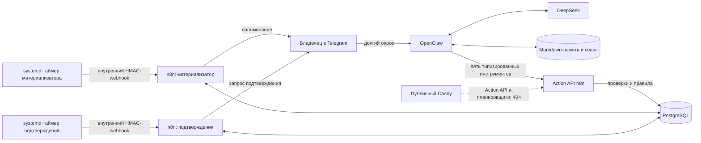

# Архитектура N8NAgents

Этот документ предназначен одновременно для владельца проекта и для агентов. Он описывает систему обычным русским языком. Точные имена программ, команд и программных объектов не переводятся.

## Коротко о системе

N8NAgents — личный Telegram-помощник, работающий на виртуальном сервере.

- **OpenClaw** отвечает за разговор, понимание свободной формулировки, контекст и долговременную память в Markdown.
- **n8n** отвечает за строгие сценарии: проверку прав, правила, подтверждения, повторяемость операций, расписание и журнал действий.
- **PostgreSQL** является главным хранилищем задач, напоминаний, состояний операций и технического журнала.
- **DeepSeek** используется как языковая модель.
- **Caddy** принимает защищённые соединения снаружи и не публикует внутренние служебные адреса.

В OpenClaw загружен плагин `n8nagents-actions` версии `0.1.3`.

С 2026-08-31 это фактическая production-архитектура: OpenClaw является единственным Telegram ingress (входом), а n8n — единственным контуром правил, действий, расписания и аудита.

## Разделение ответственности

| Компонент | Отвечает за | Не должен делать |
|---|---|---|
| OpenClaw | Разговор, понимание намерения, выбор разрешённого инструмента, контекст, Markdown-память | Напрямую менять базу, обходить правила n8n, выполнять произвольные команды или сетевые запросы |
| n8n | Проверки, деловые правила, подтверждения, расписание, интеграции и аудит | Самостоятельно вести свободный разговор вместо OpenClaw после завершения переключения |
| PostgreSQL | Надёжное хранение задач, напоминаний, повторов и истории операций | Быть доступным из интернета или принимать произвольный SQL от модели |
| DeepSeek | Понимание текста и формирование ответа | Выбирать права, получателя, токены, адреса запросов и команды сервера |
| Telegram | Канал общения с владельцем | Считаться доверенным до проверки числового идентификатора пользователя и чата |
| Caddy | Защищённая внешняя точка входа | Публиковать редактор n8n, PostgreSQL или панель OpenClaw |

## Текущая production-схема

`Action API` — закрытый внутренний программный интерфейс действий. Он доступен только внутри сети контейнеров и принимает ограниченный список команд. Внешний запрос к этому адресу получает отказ.

## Как проходит обычный разговор

1. Владелец пишет боту в Telegram.
2. OpenClaw проверяет, что сообщение пришло из разрешённого личного чата.
3. OpenClaw загружает необходимый контекст и память.
4. DeepSeek помогает понять запрос и сформировать ответ.
5. Если действие не требуется, OpenClaw отвечает сразу.
6. Если действие требуется, OpenClaw вызывает строго определённый инструмент.
7. n8n проверяет запрос, выполняет действие и возвращает структурированный результат.
8. OpenClaw объясняет результат обычным языком.

## Как создаётся напоминание

Пример запроса: «Напомни завтра в девять проверить N8NAgents».

1. OpenClaw извлекает текст задачи, дату и время.
2. OpenClaw вызывает инструмент `reminder_create`.
3. Запрос подписывается HMAC. HMAC — это проверочная подпись, которая доказывает, что запрос пришёл от доверенного компонента и не был изменён.
4. n8n проверяет подпись, срок действия запроса, отправителя и защиту от повторной отправки.
5. n8n сохраняет предложение напоминания в PostgreSQL.
6. Пользователь получает кнопки «Подтвердить» и «Отменить».
7. После подтверждения напоминание становится активным.
8. В назначенное время отдельный сценарий n8n отправляет уведомление, даже если OpenClaw в этот момент не обрабатывает разговор.

Этот путь подтверждён реальным E2E владельца: предложение появилось с двумя кнопками, подтверждение применилось один раз, клавиатура исчезла, а плановая отправка завершилась `TELEGRAM_SENT` с первой попытки. Для операции, события и доставки дубликатов не обнаружено.

## Разрешённые инструменты MVP

| Инструмент | Назначение |
|---|---|
| `reminder_create` | Создать предложение нового напоминания |
| `reminder_list` | Показать напоминания за выбранный период |
| `reminder_cancel` | Отменить выбранное напоминание |
| `reminder_reschedule` | Перенести напоминание на новое время |
| `reminder_confirm` | Подтвердить ранее созданное предложение; служебная операция для кнопки |

Модель не может передать инструменту произвольный адрес, SQL, токен, получателя или имя сценария n8n.

## Защита Action API

Внутренний интерфейс применяет следующие проверки:

- HMAC-подпись каждого запроса;
- ограниченное время действия запроса;
- одноразовый случайный номер для защиты от повторного воспроизведения;
- привязка к разрешённому пользователю и чату;
- строгая схема полей без лишних параметров;
- идемпотентность — повтор одного и того же запроса не создаёт второе действие;
- журналирование результата без сохранения секретов.

Действует `ActionAPI0000001`, версия `83bd9d8b-278c-4dd1-ad7a-3e7cac9edb69`. Его внутренний адрес: `http://n8n:5678/webhook/internal/actions/v1`. Публичная проверка возвращает `404`.

## Данные и память

### PostgreSQL

PostgreSQL хранит:

- входящие обновления Telegram и защиту от повторов;
- задачи и напоминания;
- ожидающие подтверждения;
- попытки отправки;
- ключи идемпотентности;
- технический аудит;
- служебные данные n8n.

Рабочие роли имеют только минимально необходимые права. Языковая модель не получает доступ к базе.

### Markdown-память OpenClaw

Markdown используется для понятной человеку и агентам долговременной памяти:

- явные факты, которые пользователь попросил запомнить;
- предпочтения пользователя;
- компактные итоги исследований;
- ссылки между заметками.

Секреты, токены и пароли в Markdown не сохраняются. PostgreSQL остаётся главным источником истины для задач и операций, а Markdown — смысловой памятью для рассуждений.

Векторная база в MVP не требуется. Её следует добавлять только при подтверждённой проблеме поиска по большому объёму материалов.

## Сеть и доступ

- Публично доступны только SSH на порту `22` и защищённый вход Caddy на порту `443`.
- n8n доступен на сервере через `127.0.0.1:5678` и SSH-туннель.
- PostgreSQL не имеет публичного порта.
- Панель OpenClaw не публикуется; при необходимости используется SSH-туннель.
- OpenClaw и n8n общаются по внутренней сети Docker.
- OpenClaw не получает доступ к программному интерфейсу Docker и командной строке сервера.

## Ограничения ресурсов OpenClaw

До расширения сервера OpenClaw работает как ограниченный пилот:

- память контейнера — от 384 до 512 МБ;
- процессор — не более половины одного ядра;
- одна одновременно обрабатываемая реплика разговора;
- ограничение числа процессов;
- автоматический перезапуск контейнера;
- без локальной установки на компьютер владельца.

## Приёмка внедрения

Критерии ниже закрыты production PASS, включая реальный пользовательский E2E с кнопками:

1. Он является единственным получателем входящих обновлений Telegram.
2. DeepSeek отвечает на обычное сообщение.
3. Память сохраняется после перезапуска OpenClaw.
4. Создание, просмотр, перенос и отмена напоминаний работают через разрешённые инструменты.
5. Кнопки подтверждения и отмены выполняют ровно одно действие.
6. Плановое уведомление отправляет n8n независимо от OpenClaw.
7. Неизвестный отправитель получает отказ.
8. Внутренние панели и порты не опубликованы.
9. n8n, PostgreSQL и Caddy продолжают работать без ухудшения.

## Запланированный многопользовательский режим

После принятия однопользовательского MVP система должна поддержать владельца-администратора и участников команды. Личные разговоры, память и задачи разделяются по пользователю и рабочей области. n8n повторно проверяет роль и полномочия при каждом действии. Спорные, внешние, платные, массовые и необратимые операции ожидают подтверждения владельца через отдельную карточку с кнопками.

Этот режим пока не реализуется. Проект: [[Многопользовательская_модель_OpenClaw_n8n_TARGET_2026-08-30]].

## Откат

Если OpenClaw перестал принимать Telegram-сообщения:

1. остановить OpenClaw;
2. восстановить прежний входящий адрес Telegram в n8n;
3. включить прежний входящий сценарий n8n;
4. проверить одно обычное сообщение;
5. не удалять PostgreSQL, задачи и историю операций.

## Правило документации

После успешной проверки на рабочем сервере одновременно обновляются:

- этот документ;
- [[CURRENT_STATE_N8NAgents_2026-08-29]];
- [[Participants_and_Flows_N8NAgents]];
- [[Runtime_Flows_N8NAgents]];
- [[Change_History_N8NAgents]];
- [[Промпт_Recovery_Handoff_N8NAgents_2026-08-29]].

Подробные технические снимки и машинные контракты могут содержать точные английские идентификаторы, но основные объяснения для человека должны оставаться русскими.
