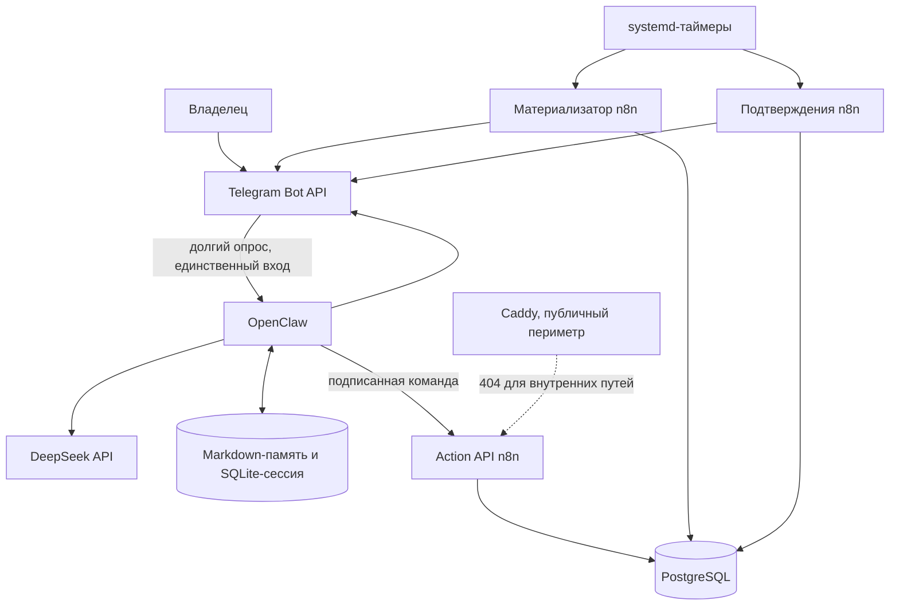
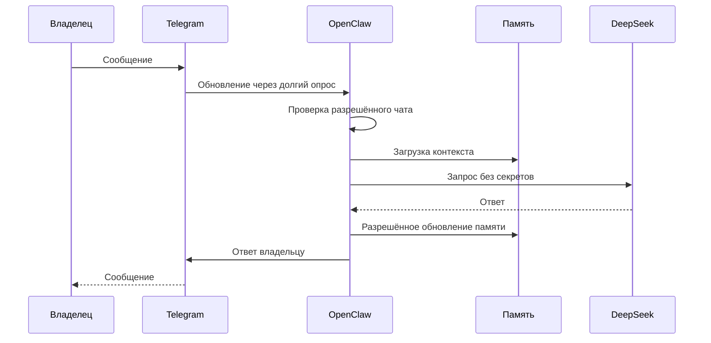
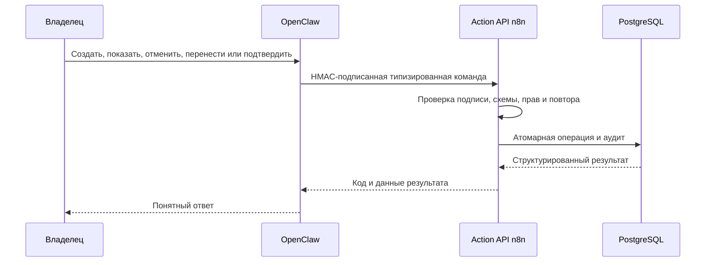
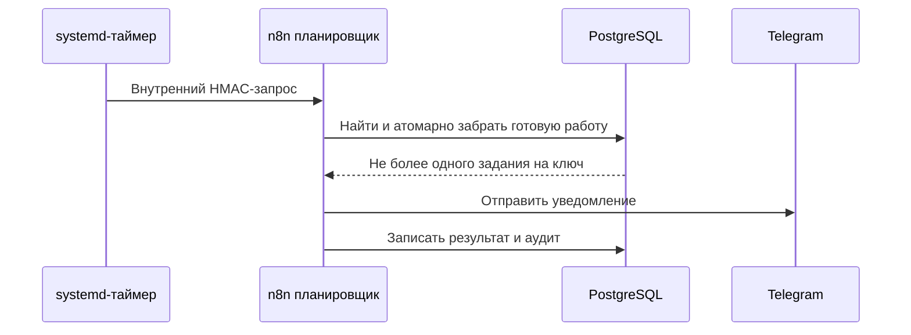
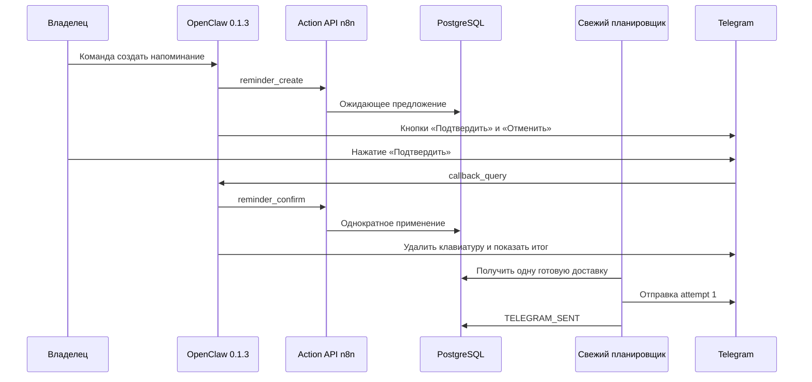

# Потоки выполнения N8NAgents

## Текущая схема рабочего сервера

OpenClaw не имеет публичного интерфейса. PostgreSQL, n8n и внутренние webhook доступны только внутри сервера; административный доступ выполняется через SSH-туннель.

## Обычный разговор

После перезапуска OpenClaw память и сессия сохраняются; это подтверждено проверкой на рабочем сервере.

## Действие с напоминанием

Точный исполнитель — workflow `ActionAPI0000001`, версия `83bd9d8b-278c-4dd1-ad7a-3e7cac9edb69`, внутренний путь `/internal/actions/v1`.

## Плановая отправка

| Назначение | Workflow | Версия | Внутренний путь | Таймер |
|---|---|---|---|---|
| Материализация напоминаний | `SchedMatFresh001` | `2347cf7a-5880-496e-a4c1-3243d641d47c` | `/internal/schedulers/fresh/materializer/v1` | `n8nagents-scheduler@materializer.timer` |
| Подтверждения и служебная доставка | `SchedConfFresh01` | `d0634147-5bf7-49c8-84cc-cd6c910b64f7` | `/internal/schedulers/fresh/confirmation/v1` | `n8nagents-scheduler@confirmation.timer` |

Оба таймера активны. Ранняя контрольная отправка доставлена ровно один раз (`message_id=56`), а две существующие пользовательские задачи остались без изменений.

## Реальный E2E с подтверждением

Фактический результат: предложение `7644fe60…` применено один раз к задаче `121347b3…`; создано по одному событию и доставке; Telegram `message_id=62`, попытка `1`, итог `TELEGRAM_SENT` в 13:17 по Москве. Все проверенные счётчики дубликатов равны нулю, а кратность операции и отправки — единице.

## Сбой и остановка

При размножении сообщений останавливается только проблемный получатель обновлений или конкретный таймер. PostgreSQL, задачи и аудит сохраняются. Прежний основной сценарий и старые планировщики остаются неактивными, пока отдельный план отката не исключит появление двух входов Telegram.

Связанные документы: [[Participants_and_Flows_N8NAgents]], [[Change_History_N8NAgents]], [[Доказательство_OpenClaw_n8n_Production_PASS_20260831]], [[Регламент_Operations_N8NAgents]].
