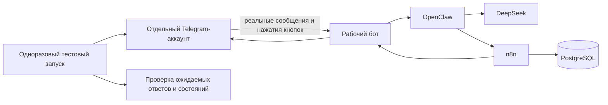

# Автоматическая сквозная проверка Telegram

## Цель

Проверять весь рабочий путь без ручных сообщений владельца:

`Telegram-пользователь → OpenClaw → DeepSeek → инструмент n8n → PostgreSQL → ответ или плановое уведомление Telegram`.

## Почему нельзя использовать второго бота

Telegram не передаёт ботам сообщения от других ботов. Поэтому Bot API не может правдоподобно имитировать человека. Для настоящей сквозной проверки нужен отдельный обычный Telegram-аккаунт, которым управляет тестовая программа через клиентский Telegram API.

## Рекомендуемая схема

Тестовый запуск хранится на сервере как выключенный по умолчанию одноразовый контейнер. У него нет публичных портов. Он запускается вручную перед выпуском или по отдельной служебной команде, выполняет сценарии, сохраняет обезличенный отчёт и завершается.

## Что потребуется от владельца один раз

1. Отдельный номер телефона и обычный Telegram-аккаунт для тестов. Основной личный аккаунт использовать не рекомендуется.
2. Создать приложение в `my.telegram.org` и получить `api_id` и `api_hash` — идентификатор и секрет клиентского приложения Telegram.
3. Один раз войти тестовым аккаунтом в защищённой форме: ввести код Telegram и, если включена двухфакторная защита, пароль.
4. Разрешить сохранить зашифрованную сессию тестового аккаунта на сервере.

Код входа и пароль не сохраняются. После первого входа повторное участие владельца не требуется, пока Telegram не отзовёт сессию.

## Изоляция тестов

- отдельный пользователь `e2e_test`;
- отдельная рабочая область `e2e`;
- отдельные задачи и память с признаком теста;
- жёсткий лимит сообщений и обращений к DeepSeek;
- запрет любых внешних действий кроме Telegram, DeepSeek и внутренних тестовых инструментов;
- автоматическое удаление тестовых задач после отчёта, но сохранение обезличенного аудита;
- тестовый аккаунт не получает административные права в настоящей рабочей области.

## Автоматический сценарий

1. Отправить обычное сообщение и проверить осмысленный ответ DeepSeek.
2. Попросить запомнить случайный тестовый факт.
3. Перезапустить только OpenClaw.
4. Спросить сохранённый факт и сравнить ответ.
5. Создать напоминание на несколько минут вперёд.
6. Найти сообщение с кнопками и программно нажать «Подтвердить».
7. Запросить список напоминаний и проверить наличие созданного.
8. Перенести напоминание и проверить новое время в PostgreSQL и ответе.
9. Запросить список на завтра и нажать кнопку удаления.
10. Создать короткое контрольное напоминание и дождаться планового сообщения от n8n.
11. Повторить одно действие тем же ключом и убедиться, что дубль не создан.
12. Временно отозвать разрешение тестового пользователя, отправить сообщение и подтвердить отказ до вызова DeepSeek.
13. Восстановить тестовую роль, удалить тестовые данные и сформировать отчёт.

## Что проверяется напрямую, без Telegram

Отрицательные проверки подписи, старого запроса, повторного одноразового номера, лишнего поля и чужого пользователя быстрее и надёжнее выполнять непосредственно против закрытого Action API. Это дополняет, но не заменяет сквозной Telegram-тест.

## Защита сессии тестового аккаунта

Сессия обычного Telegram-пользователя даёт больше полномочий, чем токен бота. Поэтому:

- используется только отдельный тестовый аккаунт;
- файл сессии шифруется и доступен только отдельному контейнеру;
- контейнер не получает Docker socket, SSH-ключи, файлы проекта и секреты рабочего владельца;
- исходящие адреса ограничиваются Telegram;
- журналы не содержат код входа, пароль, `api_hash` и содержимое сессии;
- сессию можно немедленно отозвать в настройках Telegram.

## Ограничение полной автоматизации

Автоматический тест подтверждает тот же программный путь, но от имени тестового пользователя. Он не доказывает, что именно личный Telegram-аккаунт владельца доступен с его телефона. Для этого достаточно редкой ручной проверки одним сообщением после крупных изменений, но она не обязана блокировать каждый выпуск.

## Критерий готовности

- все шаги сценария выполняются без участия владельца;
- тест нажимает настоящие кнопки Telegram;
- плановое сообщение реально приходит тестовому пользователю;
- отчёт содержит номера операций и состояния без секретов и текста личных сообщений;
- повторный запуск не зависит от результатов предыдущего;
- после завершения не остаётся активных тестовых задач.

Связанные документы: [[Архитектура_OpenClaw_n8n_TARGET_2026-08-30]], [[Многопользовательская_модель_OpenClaw_n8n_TARGET_2026-08-30]], [[Операции_OpenClaw_n8n_TARGET_2026-08-30]].
